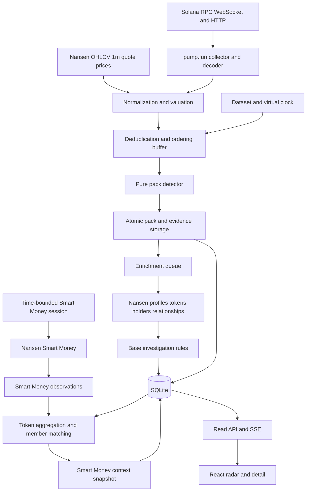
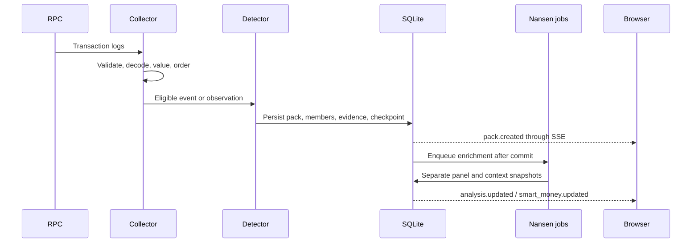
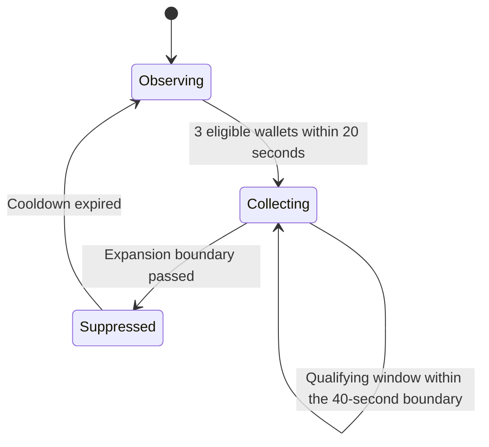

# PackLens Technical Blueprint

**Version 2.1 FINAL — English edition · September 25, 2026**

**Coding-agent contract.** Nansen is the P0 price source; do not add Jupiter or another price provider. One hundred calls is a minimum, not a ceiling. LLM integration and a combined numeric score are P1. Implement the stated defaults without asking for the same decisions again. All application copy, documentation, and demo narration are English.

Status: not implemented. Provider payloads are templates, not successful live responses. Application contracts, rules, and test vectors are normative. Validate upstream compatibility through schema inspection and smoke tests without changing product definitions.

Companions: [PRD](01-PRD-PACKLENS.md) · [MVP plan](03-MVP-AND-IMPLEMENTATION-PACKLENS.md) · [Handoff](00-START-HERE.md).

## Contents

1. [Architecture decisions](#1-architecture-decisions)
2. [Components and dependency boundaries](#2-components-and-dependency-boundaries)
3. [End-to-end data flow](#3-end-to-end-data-flow)
4. [Domain contracts](#4-domain-contracts)
5. [Collection and normalization](#5-collection-and-normalization)
6. [Pack detector](#6-pack-detector)
7. [Pattern indicators and investigation](#7-pattern-indicators-and-investigation)
8. [Nansen adapters](#8-nansen-adapters)
9. [Smart Money context engine](#9-smart-money-context-engine)
10. [Storage and consistency](#10-storage-and-consistency)
11. [Application API and SSE](#11-application-api-and-sse)
12. [Cache, queue, and budget](#12-cache-queue-and-budget)
13. [Frontend](#13-frontend)
14. [Runtime and configuration](#14-runtime-and-configuration)
15. [Operations, recovery, and verification](#15-operations-recovery-and-verification)
16. [Outstanding environment decisions and sources](#16-outstanding-environment-decisions-and-sources)
17. [Mandatory implementation details](#17-mandatory-implementation-details)

## 1. Architecture decisions

One continuously running backend owns the collector, detector, queue, API, and SSE. React reads application snapshots. SQLite stores evidence and restart state. This is a single-instance MVP architecture, not a claim of production-scale capacity.

| ADR | Decision | Rationale and boundary |
|---|---|---|
| ADR-01 | TypeScript for frontend/backend | Shared contracts reduce shape mismatches; runtime validation remains mandatory. |
| ADR-02 | React/Vite; Node.js 24/Fastify | Sufficient for the radar without P0 server-side rendering. Pin compatible versions. |
| ADR-03 | SQLite WAL on persistent disk | Simple operations and one writer. Multiple instances are out of scope. |
| ADR-04 | SSE to browsers | Primarily one-way updates; operator mutations use HTTP. |
| ADR-05 | Database-backed jobs queue | No separate queue service is needed. |
| ADR-06 | Separate Smart Money context module | Protects triggers, scores, membership, and automatic priority. |
| ADR-07 | Replay has its own clock and namespace | Prevents live, replay, and fixture evidence mixing. |
| ADR-08 | Factual P0 indicators | No new combined score or LLM dependency. |
| ADR-09 | Nansen OHLCV 1m quote prices | Closed candles, immutable snapshots, and explicit freshness; no guessed prices for newly launched tokens. |
| ADR-10 | Node 24, npm workspaces, English UI/docs | Pin compatible packages and commit package-lock. |

Fixed baseline: $20 per transaction, three unique wallets, 20-second trigger window, expansion until 40 seconds from the first evidence event, and cooldown until 120 seconds after the last accepted update. Smart Money is not an input to these parameters or functions.

## 2. Components and dependency boundaries



There is no feedback edge from Smart Money context to detection or base assessment. UI composition does not combine domain formulas.

| Module | Owns | Must not do |
|---|---|---|
| `collector` | Subscription, lookup, reconnect, gaps, decoding | Decide Smart Money status or wallet scores. |
| `normalization` | Canonical events, amounts, valuation, identity | Use provider labels for eligibility. |
| `detector` | Windows, state, evidence, membership, cooldown | Perform network calls or read Nansen context. |
| `patterns` | Timing, sizes, dominance, co-occurrence | Weight results using Smart Money counts. |
| `assessment` | Documented base investigation rules | Raise priority based on netflow or badges. |
| `smart-money` | Observations, counts, matching, coverage | Write membership, scores, triggers, or cooldowns. |
| `nansen-client` | Auth, HTTP, schemas, headers, retry | Expose an arbitrary-URL browser proxy. |
| `scheduler` | Work selection and budget | Prioritize packs using Smart Money counts. |
| `api` | Read snapshots and accept operator commands | Spend credits from public GET requests. |
| `replay` | Clock, input, mode, deterministic results | Use today's prices or modify live state. |

The detector accepts only `TradeEvent`, clock, configuration, and state. Enforce import boundaries against `smart-money`, `nansen-client`, and context DTOs in detector/patterns. Runtime invariance tests remain mandatory; import checks alone do not prove behavior.

## 3. End-to-end data flow

### 3.1 Live detection



### 3.2 Smart Money polling

An operator or active-session schedule starts a single backend poller. It applies rate limits and credit reservations, requests pages, validates responses, stores observations, and computes metrics. All browsers share these results. Browser refresh does not start another poller. Exceeding 100 calls does not stop polling.

### 3.3 Historical data

Detail endpoints read persisted packs, evidence, and versioned snapshots. Newer analysis has a separate version and timestamp. The UI does not present current token metrics as the exact state at the original trigger.

## 4. Domain contracts

### 4.1 Transaction event

```ts
type TradeEvent = {
  eventId: string; // chain + signature + decoder ordinal
  namespace: string; // live:<campaignId>, fixture:<datasetId>, replay:<runId>
  chain: "solana";
  source: "pumpfun";
  sourceMode: "live" | "backfill" | "replay" | "fixture";
  signature: string;
  eventOrdinal: number;
  slot: number;
  blockTimeMs: number;
  receivedAtMs: number;
  walletAddress: string;
  tokenAddress: string;
  side: "buy" | "sell";
  tokenAmountRaw: string;
  tokenDecimals: number;
  quoteAmountRaw: string; // traded quote amount, excluding separately identified fees
  quoteDecimals: number;
  quoteAssetAddress: string; // native SOL uses the WSOL mint for price lookup
  quoteUsdPrice: string | null;
  quotePriceAtMs: number | null; // selected candle intervalStart
  priceSnapshotId: string | null;
  priceCandleEndMs: number | null;
  valuationStatus: "valued" | "missing_price" | "stale_price" | "unsupported_quote";
  tradeValueUsd: string | null;
  priceSource: string | null;
  decoderVersion: string;
  normalizedAtMs: number;
  coreEligibility: "pending" | "eligible" | "ineligible" | "late";
};
```

Raw amounts and financial decimals are strings. Use appropriate integer/decimal arithmetic; JavaScript `Number` must not store large raw integers. Preserve Solana address capitalization. A namespace is an application boundary, not on-chain transaction identity.

An event without defensible chain time must not substitute arrival time. Keep it in lookup/observation processing until timestamp requirements are met; it cannot trigger a live pack prematurely.

### 4.2 Detector configuration

```ts
type DetectorConfig = {
  version: string;
  minTradeUsd: "20";
  minUniqueWallets: 3;
  triggerWindowMs: 20000;
  expansionFromStartMs: 40000;
  cooldownFromLastUpdateMs: 120000;
  reorderToleranceMs: 2000;
};
```

These literals freeze the MVP baseline. Future parameter experiments use another configuration version and must not mix with baseline results.

### 4.3 Pack and evidence

```ts
type Pack = {
  id: string;
  namespace: string;
  chain: "solana";
  tokenAddress: string;
  state: "collecting" | "frozen";
  configVersion: string;
  firstEventTimeMs: number;
  triggerEventTimeMs: number;
  triggeredAtMs: number;
  lastAcceptedEventTimeMs: number;
  initialWalletCount: number;
  totalWalletCount: number;
  eligibleBuyUsd: string;
  expansionEndMs: number;
  suppressUntilMs: number;
  coreVersion: number; // all core changes, including freeze
  evidenceVersion: number; // newly accepted evidence only
};

type PackMember = {
  packId: string;
  walletAddress: string;
  memberKind: "initial" | "expanded";
  firstEntryTimeMs: number; // first evidence time; displayed as entry
  initialFirstEntryTimeMs: number | null; // initial members only; immutable
  joinedAtEventTimeMs: number; // trigger or expansion-window time that admitted the member
  eligibleBuyUsd: string;
  eventIds: string[];
};
```

The detector-readable Pack domain has no Smart Money field. Page DTOs may contain Smart Money as a sibling context object. `observing` and `suppressed` are token checkpoint states; persisted packs exist only after triggering and move from `collecting` to `frozen`.

### 4.4 Panel state

```ts
type PanelState = {
  availability:
    | "not_requested" | "queued" | "available"
    | "empty" | "unavailable" | "error" | "budget_paused";
  coverage: "unknown" | "partial" | "window_scanned";
  freshness: "unknown" | "fresh" | "stale";
  fetchedAt: string | null;
  periodStart: string | null;
  periodEnd: string | null;
  reasonCode: string | null;
  snapshotIds: string[];
};
```

Availability, coverage, and freshness are independent. A snapshot can be available, partial, and stale simultaneously. `window_scanned` refers to checked provider responses, not complete knowledge of the chain.

## 5. Collection and normalization

### 5.1 Source bootstrap

1. Verify RPC HTTP/WS access and chain.
2. Obtain program identity and IDL/event layout from the [official public pump.fun repository](https://github.com/pump-fun/pump-public-docs); pin the version/hash.
3. Verify buys, sells, failed transactions, and multiple events in one signature where available.
4. Use consistent commitment, initially `confirmed`; record it in datasets and source UI.
5. Identify the trading wallet through the event/program, not by assuming the first signer is always the buyer.

Use [Solana logsSubscribe](https://solana.com/docs/rpc/websocket/logssubscribe). Block time may require HTTP lookup; cache relevant slot/block lookups and respect RPC limits. Subscription logs may not contain every field required by the application.

### 5.2 Deduplication and precision

Event identity uses a deterministic position in decoded transaction logs. One signature may contain multiple valid events. Deduplicate before volume, membership, and enrichment scheduling.

Same ID and identical contents is a no-op. Same ID with a different payload is an audit conflict; never overwrite a pinned event or USD value. Keep bounded debug logs for decoding failures, not unlimited raw responses. Failed transactions, invalid mints, schema-invalid negative values, and ambiguous directions cannot become eligible purchases.

### 5.3 Valuation: Nansen as the sole P0 price source

**Decision:** actual traded quote amount × quote asset USD price from `POST /api/v1/tgm/token-ohlcv`. The target token's own price is unnecessary to value the payment. Map native SOL to WSOL for the price query. Other quote mints require allowlisting. Do not assume a stablecoin is always $1.

Nansen exposes `timeframe=1m`, `close`, and `interval_start`; the latest candle may be open. See [Price OHLCV](https://docs.nansen.ai/api/token-god-mode/price-ohlcv). The following is PackLens's conservative policy, not a claim of tick-level accuracy.

**Locked algorithm:**

1. Poll one request per quote asset every 30 seconds during an active live session. Fetch at bootstrap before enabling USD eligibility; collection may already record events.
2. Request the preceding ten minutes with `timeframe: "1m"` and `date.to = floor(now/60000)*60000`, encoded as ISO UTC. This targets completed candles; use `date`, not deprecated `date_range`. Avoid a long default range.
3. Persist an immutable snapshot with requestStartedAt, responseReceivedAt, availableAt, raw normalized candles, provider request ID, and namespace. availableAt means the snapshot passed normalization and became readable from committed storage.
4. For event time `E` and first arrival `R`, use only snapshots where `availableAt <= R`. Choose the latest candidate with `candleEnd = intervalStart + 60000 <= E`, a finite positive close, `0 <= E - intervalStart <= 120000`, and `0 <= R - availableAt <= 120000`.
5. Without a valid candidate, set tradeValueUsd=null and a missing/stale/unsupported reason. Do not recalculate live eligibility from prices becoming available after R. Later reconstruction requires a separate replay/recovery namespace.
6. Multiply the traded quote amount by close using decimal arithmetic. Evaluate $20 before rounding. Exclude separately identified network and program fees.
7. Pin priceSnapshotId, candle bounds, close, formula version, and USD result to the event. Later price responses cannot rewrite historical event values. Replay uses pinned prices/values, not subsequently revised historical provider prices.

Closed candles prevent using later prices within the event's own minute during replay. The result is an estimate using a preceding candle, not an exact per-swap market price. Near-threshold outcomes may differ from other sources; display valuation provenance.

intervalStart is not a refresh timestamp. Show candle period and fetch time separately. Refetching an old candle does not make it fresh. Missing candles, null close, `truncated=true`, or subject mismatch cannot feed detection; narrow the requested range if truncated.

**Nansen outage:** a still-valid cache remains usable. Once invalid, keep collection running and report `waiting_for_price`; unvalued purchases must not pass the threshold. Profile/Smart Money failure only delays context panels. Do not silently introduce a second price provider.

Synthetic example: E=12:02:10, R=12:02:11. A snapshot available at 12:02:05 contains [12:01:00,12:02:00), close=200. Its start is 70 seconds before E, so 0.1 SOL values to $20. Reject [12:02:00,12:03:00), and reject a snapshot first available at 12:02:12.

DEFAULT quote support is native SOL/WSOL. Additional quotes, including USDC, require explicit configuration and passing decoder, mint/decimal, and Nansen-price smoke tests. Record unsupported quotes as `unsupported_quote`. Show active quote coverage in the UI.

### 5.4 Ordering, clock, and late events

Define `E=blockTimeMs`, `R=receivedAtMs` for first log arrival, and `N=normalizedAtMs` after lookup/decoding. Use a monitored UTC application clock. Inject the clock for tests/replay; domain code does not call `Date.now()` directly.

Every 250 ms, advance namespace watermark `W = max(previousW, floor(clockNowMs)-2000)`. Before advancing it, drain already normalized events with `E <= newW`, sorted by `(E, slot, signature, ordinal)`. An event newly normalized with `E <= previousW` is late and excluded from live detection. Slow RPC lookup can reduce coverage under the two-second tolerance; measure and report it rather than silently changing the baseline.

At equal timestamps process events before inclusive-boundary timers. Freeze a pack only when the watermark is **greater than** expansionEnd, not equal. Never freeze against wall clock before draining the reorder buffer; an event exactly at 40 seconds must remain admissible.

Backfill cannot create packs in the live namespace. Store it as backfill observation and use separate recovery/replay reconstruction. Late events cannot rewrite initial membership, original evidence, or live alerts. Separate correction/invalidation audits may expose new information without concealing the original outcome.

Replay modes must be explicit. `recorded-arrival` reproduces original arrival/normalization/ticks and pinned prices. `historical-event-time` evaluates a complete dataset using a virtual clock; it does not claim equivalence with a live run that had gaps. Determinism requires equal mode, input order, clock, prices, and configuration.

## 6. Pack detector

### 6.1 Per-token state

Checkpoint by `(namespace, chain, mint)`: candidate buffer, active pack ID, first event time, last accepted time, suppressUntil, watermark, and config version.



Persisted packs move collecting → frozen. Tokens remain suppressed until cooldown ends. Observation and buffering continue while suppressed, but no new alert is triggered during that period.

### 6.2 Trigger window

For an eligible purchase at `t`, use inclusive `[t-20000, t]`. Select unique eligible events for the same token. Count distinct wallets: another trade by the same wallet adds eligible value, not another unique wallet.

If at least three wallets are present and the token is no longer suppressed, create a pack from all eligible events in that window. firstEventTime is the earliest included evidence, not when monitoring started. Initial members are the unique wallets at trigger.

### 6.3 Expansion

While collecting, evaluate the same rolling-window rule. Accept updates only when the window contains at least three eligible wallets and the new event is no later than firstEventTime+40000. Union newly accepted unique window events within the pack's expansion interval with existing evidence.

Preserve existing initial/expanded membership classification. A new wallet becomes expanded. Events outside the qualifying window/duration remain observations or follow-up, not formation evidence.

Advance lastAcceptedEventTime only when new evidence is accepted. Duplicates, UI refresh, Nansen results, or ineligible observations do not extend cooldown. `suppressUntil = lastAcceptedEventTime + 120000`.

Freeze after expansion. At cooldown expiry, a qualifying current window may trigger another pack. Persist decisions and config version so differences from the reference system remain traceable.

### 6.4 Core pseudocode and transactions

Ingress deduplication is distinct from detector processing. An event already in storage may still require core processing. Persist `detector_applied` or an equivalent processed cursor atomically with the checkpoint. Insert the event into the window **before** counting wallets. Do not perform network I/O inside the DB transaction.

```text
consumeOrdered(event, tokenState, config):
  begin DB transaction
  if event.detectorApplied: commit no-op; return
  if late, backfill, sell, or unvalued or USD < 20:
    mark detectorApplied with reason; persist observation; commit; return

  # Event time has passed admission/watermark checks.
  # Finalize old state first so the same event can trigger a new pack.
  if activePack exists and event.time > activePack.expansionEnd:
    freeze activePack; clear activePackId

  insert event into token eligible buffer if absent
  prune buffer times strictly less than event.time - 20s
  window = eligible unique events in [event.time - 20s, event.time]
  walletSet = distinct addresses(window)

  if activePack exists:
    if event.time <= expansionEnd and walletSet.size >= 3:
      added = window events inside [pack.firstTime, expansionEnd]
              minus existing evidence IDs
      if added is not empty:
        union evidence and derive members/summaries
        lastAcceptedTime = max(time of all accepted evidence)
        suppressUntil = lastAcceptedTime + 120s
  else if event.time >= suppressUntil and walletSet.size >= 3:
    create deterministic pack ID from namespace/config/mint/trigger eventId
    initial evidence = window; initial members = walletSet
    firstTime = min(window.time); expansionEnd = firstTime + 40s
    lastAcceptedTime = max(window.time); suppressUntil = lastAcceptedTime + 120s

  persist buffer/checkpoint, processed marker, evidence and outbox atomically
  commit

advanceWatermark(W):
  freeze collecting packs whose expansionEnd < W in DB transaction
  retain suppressUntil even when activePackId becomes null
```

One namespace writer serializes consumption and timers. A pre-commit crash causes safe reprocessing; a post-commit retry is a no-op. An event that freezes the old pack must still be considered for a new trigger after cooldown; do not return early merely because old state was frozen.

Initial members and initialFirstEntryTimeMs are immutable after triggering. Expansion may accept an earlier observation from within the expansion period; mark it `acceptedAtExpansion=true`. For expanded members, keep firstEntryTimeMs (first evidence time) separate from joinedAtEventTimeMs (the window that admitted the member). UI entry uses evidence time and explains joining time. Count each evidence event's value once.

### 6.5 Required boundaries

| Input | Expected |
|---|---|
| A/B/C at 0, 7, 20 seconds, $20 each | Trigger. |
| A/B/C at 0, 7, 20.001 seconds | No trigger from those three events. |
| A five times and B once | Two unique wallets. |
| One purchase is $19.99 | That purchase is ineligible. |
| Two $10 purchases by one wallet | Do not combine into an eligible $20 transaction. |
| Duplicate signature+ordinal | No extra evidence or value. |
| Valid expansion window at exactly 40 seconds | Expansion allowed. |
| New event after 40 seconds | Not a formation member. |
| Nansen response 30 seconds after trigger | Membership and cooldown unchanged. |
| Event exactly at suppressUntil | May trigger if its window qualifies. |

## 7. Pattern indicators and investigation

### 7.1 Factual indicators

P0 displays values and definitions, not invented probabilities:

- `entrySpanMs`: latest minus earliest first entry among the stated initial/all-member set.
- `buySizeCV`: population standard deviation of eligible value per member divided by its mean. Show n, denominator, and formula version; null if insufficient or mean is zero.
- `largestBuyerShare`: largest member's eligible value divided by total eligible pack value. This is not supply concentration.
- `cooccurrencePairCount`: member pairs also observed in other-token packs before this pack, within the actually recorded previous 24 hours.

Co-occurrence cannot read future packs in replay. Show actual coverage if less than 24 hours was observed. Store formulas, versions, and inputs. Smart Money is not an input. No combined P0 score.

### 7.2 Deterministic base assessment

Assessment returns investigation reasons, not price predictions. `CHECK_RELATIONSHIP` requires a provider-returned direct relationship between members; shared exchange/service funding does not establish common control.

`CHECK_CONCENTRATION` requires an explicitly configured threshold and valid distribution/denominator. DEFAULT threshold=null: display factual values without an invented flag. Threshold units are a 0–1 ratio for the top 20 holders' combined share of verified total supply. If ordering or denominator is unavailable, do not flag even with a configured threshold.

analysisState is not_requested, queued, running, partial, complete, error, or budget_paused. Complete means every actually scheduled job reached a valid terminal result; it does not mean all members or the whole chain were analyzed. Coverage includes scheduledMemberCount and totalMemberCount. Avoid “safe” and “ready to buy.”

Select the first three initial members by `(initialFirstEntryTimeMs, walletAddress)` ascending. Radar order is `(triggerEventTimeMs DESC, id DESC)` and is unchanged by enrichment. Job priority follows §12.2. Base provider evidence may affect documented assessment fields; Smart Money, LLMs, and later prices cannot.

Per-wallet size is the sum of eligible evidence in the pack version. CV uses population standard deviation. Co-occurrence uses sorted address pairs, another token, the same namespace, strictly earlier trigger time, and a 24-hour lookback. Exclude audited-invalidated packs from subsequent analysis; retain historical input versions for audit. `patternScore=null` in P0.

## 8. Nansen adapters

### 8.1 Endpoint contracts

Base URL: `https://api.nansen.ai`. All operations below use POST. This table summarizes adapters; upstream schemas still need validation.

| Endpoint | Important inputs | Used output |
|---|---|---|
| `/api/v1/tgm/token-ohlcv` | chain, token_address, timeframe=1m, date | Quote candles required for USD valuation. |
| `/api/v1/tgm/token-information` | chain, token_address, timeframe | Available token context; do not assume a spot-price field. |
| `/api/v1/tgm/holders` | chain, token_address, pagination, premium_labels=false | Balances, available labels, distribution, warnings. |
| `/api/v1/profiler/address/pnl-summary` | chain, wallet_address, date | Period-specific wallet performance summary. |
| `/api/v1/profiler/dex-trades` | chain, address, date, pagination | Wallet trading history. |
| `/api/v1/profiler/address/related-wallets` | chain, wallet_address, pagination | Relationships actually returned by the source. |
| `/api/v1/profiler/address/current-balance` | chain, address, pagination | Selected balances; local mint filtering only covers fetched pages. |
| `/api/v1/smart-money/dex-trades` | chains, filters, pagination, order_by | Trade observations and buyer identities. |
| `/api/v1/smart-money/netflow` | chains, token filter, pagination | Provider flow metrics by period. |

Use sources in §16 and pinned schema fixtures. Validate every response against requested chain and subject. `address` and `wallet_address` vary by operation; do not use a generic request body for all endpoints. Smart Money Holdings is not required in P0.

### 8.2 Client pipeline

`validate request → canonical parameter hash → cache/single-flight → reserve credits → send → capture headers → validate response → normalize → persist snapshot → settle reservation → update ledger`.

Send the backend-only key in `apikey`. Never put it in query parameters, bundles, logs, or browser responses. Redact credentials embedded in RPC URLs. Store provider request IDs and cost headers when present.

Null/empty responses are not automatically errors. Conversely, important schema changes fail domain normalization even on HTTP 200. Record HTTP and normalization success independently. Settlement must also run on error/finally paths: schema failure does not undo provider charges. Snapshot persistence failure must not erase the attempt or cost; record the outcome separately for reconciliation.

### 8.3 Targeted Smart Money payload

```json
{
  "chains": ["solana"],
  "filters": { "token_bought_address": "<MINT_TOKEN>" },
  "pagination": { "page": 1, "per_page": 100 },
  "order_by": [{ "field": "block_timestamp", "direction": "DESC" }]
}
```

This is an unexecuted template. Smart Money DEX provides a rolling last-24-hour feed; use supported bought-token filters and pagination, then compute 5m/1h/24h locally. Do not invent an arbitrary historical date range. See [Smart Money DEX](https://docs.nansen.ai/api/smart-money/dex-trades).

Request netflow separately with a token filter. Preserve provider periods; netflow is not transaction evidence for a pack. See [Netflow](https://docs.nansen.ai/api/smart-money/netflows).

### 8.4 Error policy

| Condition | Action |
|---|---|
| 402 credits/payment unavailable | Pause paid dispatch with an account reason; no automatic purchase or top-up. |
| 401/403 access failure | Pause affected jobs until configuration is fixed. |
| 400/422 or incompatible schema | Do not retry an identical request; record adapter failure. |
| 429 | Respect Retry-After, local limiter, session, and budget. |
| Timeout/5xx | At most two retries with backoff/jitter; record every attempt. |
| Unknown actual cost | Keep a conservative unresolved reservation until reconciliation. |
| Missing token/empty result | Set empty/unavailable according to evidence; bounded relevant retry if appropriate. |

## 9. Smart Money context engine

### 9.1 Observations and provenance

```ts
type SmartMoneyObservation = {
  id: string;
  chain: "solana";
  transactionHash: string;
  traderAddress: string;
  tokenBoughtAddress: string;
  tokenSoldAddress: string;
  blockTimeMs: number;
  tradeValueUsd: string | null;
  fingerprint: string;
  ambiguousSwapIdentity: boolean;
  scopeHash: string;
  snapshotId: string;
};
```

Preserve extra metadata/amounts when available; core metrics do not depend on symbols. Scope includes chain, endpoint, label/category filters, token filters, pagination, adapter version, and fetch time. DEFAULT uses the endpoint's group scope; free-text labels do not define membership.

An observation appearing in both global feed and token lookup has one evidence identity with multiple snapshot/scope references. A different scope hash is not a reason to duplicate a trade. Do not merge different category scopes without an explicit coverage decision.

### 9.2 Trade identity and ambiguity

One transaction hash may contain several swaps. Fingerprint chain, hash, wallet, token pair, amounts, and time using available fields. If identical swaps cannot be distinguished, mark ambiguity: unique-wallet count can remain usable, but USD value cannot be claimed exact. A fingerprint does not invent a missing log ordinal.

### 9.3 Token buyer calculation

For snapshot reference time T and duration D, use `(T-D, T]`. Require the correct chain/mint, bought-token side, valid time, and consistent scope. Count `size(Set(traderAddress))`.

Use one T for all three windows. Switching tabs does not change asOf. Count addresses, not transaction hashes or entity labels. Different mints with identical symbols remain separate.

Sum only deduplicated trades with known value and sufficiently certain swap identity. Store missing-valuation and ambiguous-row counts. Observed value always carries coverage; partial value is not market-wide total volume.

### 9.4 Metric contracts

```ts
type SmartMoneyWindowMetric = {
  window: "5m" | "1h" | "24h";
  windowStart: string;
  windowEnd: string;
  observedUniqueBuyers: number | null;
  countQualifier: "observed" | "at_least" | "unknown";
  knownBuyUsd: string | null;
  missingValuationCount: number;
  ambiguousTradeCount: number;
  state: PanelState;
  scopeHash: string;
};

type PackSmartMoneyContext = {
  packId: string;
  evidenceVersion: number | null; // null if never checked
  contextVersion: number;
  confirmedMemberCount: number | null;
  checkedMemberCount: number;
  totalMemberCount: number;
  matchedObservationIds: string[];
  memberMatches: {
    walletAddress: string;
    matchState: "not_checked" | "checked_no_match" | "wallet_seen"
      | "pack_buy_confirmed" | "ambiguous";
    matchedObservationIds: string[];
    checkedAt: string | null;
  }[];
  state: PanelState;
  updatedAt: string | null;
};
```

Before checking: confirmedMemberCount=null, evidenceVersion=null, checkedMemberCount=0. After partial checking, show known confirmed count and coverage. checkedMemberCount is not a count of wallets proven not to be Smart Money.

Pack confirmation is historical evidence, distinct from rolling token metrics. An old badge does not disappear just because its transaction leaves the provider's 24-hour window; retain the evidence date.

### 9.5 Coverage and pagination

A single global-feed page rarely proves all token buyers are covered. If relevant and funded, schedule a targeted lookup. Scan newest first. A window may be scanned when the scan crosses its lower bound or reaches the last page, provided no unresolved gaps/page shifts remain.

Rolling endpoints may change between pages. Use overlap and dedup; preserve fetch start/end, page count, oldest/newest timestamps, last-page status, and continuity evidence. Without stable snapshots/cursors or provable continuity, use partial coverage. Reaching the last page alone does not guarantee full rolling-24-hour coverage.

Bootstrap does not prove earlier history is complete. Delayed indexing may update a later snapshot; previous snapshots keep their times/versions. An unindexed token is not zero Smart Money.

### 9.6 Pack member confirmation

Strong matching requires chain, wallet, bought mint, and a transaction hash belonging to pack evidence. confirmedMemberCount counts distinct wallets with `matchState=pack_buy_confirmed`, not observation rows.

USD ambiguity alone does not invalidate an otherwise certain buy match. Use ambiguous when the purchase match itself is uncertain. Multiple swaps in one transaction may justify “Transaction matched; value uncertain” without claiming exact allocation.

A wallet on another token is only wallet_seen. A nonmember buying the pack token contributes token activity. Seller-only activity is not a buyer. Missing from the checked sample means unconfirmed, not proven absent.

### 9.7 Invariance

Repeat identical core input with Smart Money disabled, failed, zero, large, positive/negative netflow, and delayed. Compare core results excluding transport timestamps and copied context IDs. Triggers, initial/expanded members, evidence, pattern indicators, cooldown, base assessment, and automatic priority must match.

The module may write observations, matches, token metrics, snapshots, and related usage only. Give it restricted repository methods, not a general pack-mutation repository.

## 10. Storage and consistency

### 10.1 Table inventory

| Table | Identity/data | Rule |
|---|---|---|
| `namespaces` | ID, mode, replay run, creation time | Separate live/replay/fixture. |
| `trade_events` | namespace+event_id, mint, wallet, signature, ordinal, time, payload | Unique within namespace; raw amounts are strings. |
| `packs` | ID, namespace, mint, state, times, config, summary | No Smart Money inputs to detection. |
| `pack_events` | pack_id+event_id, namespace, evidence role | Pack/event FKs must share namespace. |
| `pack_members` | pack_id+wallet, kind, entry, value | Unique member per pack. |
| `detector_checkpoints` | namespace+chain+mint, buffer, active ID, suppressUntil, watermark | Restore before resuming live processing. |
| `enrichment_snapshots` | ID, subject, endpoint, parameter hash, time, result/state | Immutable; new responses produce new versions. |
| `pack_assessments` | pack_id+version, rules, reasons, snapshot references | Base assessment only. |
| `smart_money_observations` | ID, fingerprint, chain/hash/wallet, bought/sold mints, amounts | One observation may have several sources. |
| `smart_money_observation_sources` | observation_id+snapshot_id, scope_hash | Provenance without double-counting value. |
| `pack_smart_money_evidence` | pack_id+observation_id+wallet, match level | Does not write pack membership. |
| `token_smart_money_metrics` | ID, mint/window/asOf/scope, result/state/sources | Window snapshots; unknown is null. |
| `poller_checkpoints` | session/scope, page, bounds, request_count | Prevent duplicate polling; count is a metric, not a cap. |
| `jobs` | ID/type/subject, active dedupe key, lease, attempts/status | Active key unique; release on terminal state. |
| `api_usage` | attempt/job/endpoint, HTTP/schema status, quoted/actual credits | One row per attempt; cache hit is not a request. |
| `budget_reservations` | attempt/campaign, estimate/status | Reserved, settled, unresolved. |
| `collector_gaps` | namespace, bounds, reason, recovery state | Refresh does not clear gaps. |
| `event_outbox` | sequence/type/aggregate/version/payload | Same transaction as the corresponding change. |
| `replay_runs` | dataset hash, config, clock, result hash | Comparable across runs. |

### 10.2 Core SQL constraints

This executable excerpt is not a complete migration. Additional columns/tables follow domain contracts and §17.6.

```sql
CREATE TABLE namespaces (
  id TEXT PRIMARY KEY,
  mode TEXT NOT NULL CHECK (mode IN ('fixture', 'live', 'replay')),
  created_at_ms INTEGER NOT NULL
);

CREATE TABLE trade_events (
  namespace TEXT NOT NULL REFERENCES namespaces(id),
  event_id TEXT NOT NULL,
  chain TEXT NOT NULL CHECK (chain = 'solana'),
  mint TEXT NOT NULL,
  wallet TEXT NOT NULL,
  event_time_ms INTEGER NOT NULL,
  side TEXT NOT NULL CHECK (side IN ('buy', 'sell')),
  payload_json TEXT NOT NULL,
  PRIMARY KEY (namespace, event_id)
);

CREATE TABLE packs (
  id TEXT PRIMARY KEY,
  namespace TEXT NOT NULL REFERENCES namespaces(id),
  mint TEXT NOT NULL,
  state TEXT NOT NULL CHECK (state IN ('collecting', 'frozen')),
  config_version TEXT NOT NULL,
  evidence_version INTEGER NOT NULL DEFAULT 1,
  core_version INTEGER NOT NULL DEFAULT 1,
  trigger_event_time_ms INTEGER NOT NULL,
  triggered_at_ms INTEGER NOT NULL,
  summary_json TEXT NOT NULL,
  UNIQUE (id, namespace)
);

CREATE TABLE pack_events (
  pack_id TEXT NOT NULL,
  namespace TEXT NOT NULL,
  event_id TEXT NOT NULL,
  PRIMARY KEY (pack_id, event_id),
  FOREIGN KEY (pack_id, namespace) REFERENCES packs(id, namespace),
  FOREIGN KEY (namespace, event_id)
    REFERENCES trade_events(namespace, event_id)
);

CREATE TABLE pack_members (
  pack_id TEXT NOT NULL REFERENCES packs(id),
  wallet TEXT NOT NULL,
  member_kind TEXT NOT NULL CHECK (member_kind IN ('initial', 'expanded')),
  first_entry_time_ms INTEGER NOT NULL,
  summary_json TEXT NOT NULL,
  PRIMARY KEY (pack_id, wallet)
);

CREATE TABLE event_outbox (
  sequence INTEGER PRIMARY KEY AUTOINCREMENT,
  namespace TEXT NOT NULL REFERENCES namespaces(id),
  event_type TEXT NOT NULL,
  aggregate_id TEXT NOT NULL,
  aggregate_version INTEGER NOT NULL,
  created_at_ms INTEGER NOT NULL,
  payload_json TEXT NOT NULL
);

CREATE INDEX trade_events_token_time
  ON trade_events(namespace, chain, mint, event_time_ms);
CREATE INDEX trade_events_wallet_time
  ON trade_events(namespace, wallet, event_time_ms);
CREATE INDEX packs_recent
  ON packs(namespace, trigger_event_time_ms DESC, id DESC);
CREATE INDEX outbox_namespace_sequence
  ON event_outbox(namespace, sequence);
```

Enable foreign keys on every connection, WAL for the single instance, and a busy timeout. Validate JSON columns on write/read. Test these constraints again when constructing complete migrations.

### 10.3 Atomicity and recovery

One DB transaction writes new evidence, members, summaries, checkpoint, and outbox. Register enrichment jobs in that transaction or through an idempotent outbox consumer. A failed commit must not publish a successful update.

Claim jobs using atomic status changes and leases. Expired running leases return to the queue with bounded recovery. A sent HTTP request whose response was lost has an unknown outcome: retain its attempt/reservation rather than assuming it was uncharged.

### 10.4 Retention and size

DEFAULT pack evidence/relevant snapshots: seven days; pin demo datasets until judging ends. Retain the ledger throughout the hackathon campaign. Non-pack events: 24 hours, excluding active checkpoints/buffers. Clean hourly in batches. Keep outbox entries 24 hours; older Last-Event-ID requires resync.

Rotate raw debug capture at 200 MB. On critically low disk, stop the write path and report degraded rather than silently discarding evidence. Never delete referenced evidence, pinned snapshots, or active-job data. Measure throughput and record sizes before sizing disk. Use a WAL-consistent SQLite backup, not a naive copy of an actively written database file.

## 11. Application API and SSE

### 11.1 API principles

Use ISO UTC or explicitly named epoch-ms fields. USD decimals are strings. Cursors encode stable ordering, not drifting offsets. Validate chain/mint server-side. All public GET requests read storage, including when a snapshot is unavailable.

| Method and route | Input | Response/effect |
|---|---|---|
| `GET /api/health` | None | Basic liveness without secrets. |
| `GET /api/status` | Allowed namespace/mode | Source health, latest event, gap summary. |
| `GET /api/packs` | cursor, limit, minWallets, minUsd, time, display filters | List and nextCursor. |
| `GET /api/packs/:id` | ID | Separate core, members, evidence, patterns, assessment, smartMoney, coverage. |
| `GET /api/wallets/:chain/:address` | Identity | Available stored profile. |
| `GET /api/tokens/:chain/:address` | Identity | Token context, Smart Money metrics, related packs. |
| `GET /api/smart-money/activity` | cursor, optional token | Shared feed snapshot and scope. |
| `GET /api/events` | Namespace, Last-Event-ID | SSE stream. |
| `POST /api/admin/enrich/:packId` | Operator auth, Idempotency-Key | 202 and job ID; not synchronous provider data. |
| `POST /api/admin/smart-money/session` | Duration/interval within configured bounds | Start/update session; separate credit budget and no total-request quota. |
| `POST /api/admin/replay` | Registered dataset ID | New replay namespace. |
| `GET /api/admin/usage` | Operator auth | Actual/reserved/unresolved credits and attempts; account balance is not public. |

Default list size is 25; maximum 100 records per page. This does not limit total API calls. Address filters do not accept URLs. Replay accepts a registered dataset ID, not an arbitrary filesystem path or command.

### 11.2 Canonical detail DTO

Reuse §4/§9 types. Do not rename totalWalletCount to walletCount or create incompatible abbreviated response shapes. This is PackLens's contract, not a raw Nansen response.

```ts
type Mode = "fixture" | "live" | "replay";
type Envelope<T> = {
  schemaVersion: string;
  namespace: string;
  mode: Mode;
  data: T;
  requestId: string;
};
type Panel<T> = { data: T | null; state: PanelState };
type PatternMetrics = {
  formulaVersion: "patterns-v1";
  initialEntrySpanMs: number;
  allMemberEntrySpanMs: number;
  memberCount: number;
  buySizeCV: string | null;
  largestBuyerShare: string | null;
  cooccurrencePairCount: number;
  cooccurrenceCoverageStart: string | null;
  patternScore: null;
};
type Assessment = {
  version: number;
  analysisState: "not_requested" | "queued" | "running" | "partial"
    | "complete" | "error" | "budget_paused";
  reviewFlags: ("CHECK_RELATIONSHIP" | "CHECK_CONCENTRATION")[];
  scheduledMemberCount: number;
  totalMemberCount: number;
  snapshotIds: string[];
};
type Netflow = {
  asOf: string | null; // provider timestamp if available; never fabricate
  fetchedAt: string;
  values: {
    window: "1h" | "24h" | "7d" | "30d";
    netFlowUsd: string | null;
  }[];
  scopeHash: string;
};
type PackDetail = {
  core: Pack;
  members: PackMember[];
  evidence: TradeEvent[];
  patterns: PatternMetrics;
  assessment: Assessment;
  smartMoney: {
    contextVersion: number;
    asOf: string | null;
    windows: SmartMoneyWindowMetric[]; // exactly 5m, 1h, 24h, in this order
    packConfirmation: PackSmartMoneyContext;
    netflow: Panel<Netflow>;
  };
  coverage: {
    source: "pumpfun";
    commitment: "confirmed";
    quoteMints: string[];
    gapIds: string[];
    lateEventCount: number;
    unvaluedEventCount: number;
    auditedInvalidated: boolean;
  };
};
type PackDetailResponse = Envelope<PackDetail>;
```

Use `schemaVersion="pack-detail.v1"`; all objects must match the envelope namespace. Unchecked panels use explicit state and null results. Always provide the three windows with clearly stated reference bounds, without implying observations exist. Once a snapshot exists, pin asOf/bounds to it; rendering does not move them.

A separate evidence cursor is permissible if size requires it; P0 may return the full evidence set for one pack with validated collector input sizes.

On creation: coreVersion=1 and evidenceVersion=1. New evidence increments both. Freeze increments coreVersion only. Enrichment/Smart Money increments neither. `pack.created/updated` uses coreVersion; context and assessment have separate counters. This prevents the browser discarding a freeze update simply because evidenceVersion is unchanged.

### 11.3 Error response

Use `{error:{code,message,retryable,requestId}}`. Codes include INVALID_INPUT, NOT_FOUND, UNAUTHORIZED, BUDGET_PAUSED, SOURCE_UNAVAILABLE, SNAPSHOT_NOT_READY. User-facing messages are English. A panel dependency failure usually leaves the detail response HTTP 200 with that panel's error state. Failure to read the whole object uses the appropriate HTTP error.

### 11.4 SSE events

Types: `pack.created`, `pack.updated`, `analysis.updated`, `smart_money.updated`, `source.status`, `resync_required`. Include sequence, namespace, aggregate ID, and the appropriate version. Retrieve large payloads through snapshot GET requests.

Send a heartbeat, for example every 15 seconds. Ignore older aggregate versions. Reconnect with Last-Event-ID; replay retained outbox records or request resync if the cursor expired. After resync, reload list/detail with the current cursor. Delivery is not exactly once; consumers must be idempotent.

## 12. Cache, queue, and budget

### 12.1 Cache

| Object | Initial TTL/schedule | Notes |
|---|---|---|
| Quote OHLCV 1m | Poll every 30 seconds in an active session | Shared per quote; candle selection follows §5.3. |
| Token information | 120 seconds | Per token/timeframe; upstream cache may be older. |
| Holders | 300 seconds | Include label and aggregation scope in key. |
| PnL summary | 60 minutes | Date window must match. |
| Wallet DEX | 5 minutes | Include pagination and date. |
| Related wallets | 15 minutes | Preserve checked scope. |
| Selected current balance | 60 seconds | Do not poll every member automatically. |
| Smart Money DEX | Shared session snapshot | DEFAULT poll interval 120 seconds; respect limits/budget. |
| Netflow | 5 minutes | Per token/filter. |

Canonical keys include endpoint, chain, address/mint, period, filters, page, adapter version. Identical in-flight jobs share one request. Recalculating 5m/1h/24h from one snapshot does not create three provider requests.

### 12.2 Locked queue and priority rules

DEFAULT Nansen concurrency is two requests; limiter is 30 requests/minute. Use stricter provider limits when necessary. At most 50 packs wait for base enrichment; other candidates remain persisted as not_requested and are reconsidered every five minutes.

Select unscheduled candidates by `totalWalletCount DESC, eligibleBuyUsd DESC, triggerEventTime DESC, id ASC`, then enqueue FIFO. Do not read Smart Money counts.

Lane priority: **PRICE → BASE_ENRICHMENT → SMART_MONEY**. Do not cancel in-flight requests. A due price request gets the next available slot. One logical worker owns price polling. Base jobs use enqueueAt FIFO; retries observe nextAttemptAt. Coalesce delayed Smart Money poll ticks instead of accumulating jobs.

Keep two future price polls reserved from enrichment spending: `priceReserve = 2 × activeQuoteCount × priceRequestCost`. This is an accounting reserve usable by PRICE, not a request quota. Concurrent reservations share one atomic transaction. If the entire budget runs out, apply the stale-price policy; do not claim unlimited USD detection without valid prices.

Smart Money independence concerns the core function over **identical events + prices + clock + configuration**. Shared resources can affect price availability; priority/reserves reduce that operational interference. Invariance tests must not quietly ignore differing core inputs.

### 12.3 Ledger and reservations

Track separately: actual HTTP requests, successful HTTP responses, useful normalized results, and actual credits. Cache hits are local activity. One hundred calls does not mean 100 credits. Minimum and initial 300-call planning counters are reporting milestones, never scheduler stop conditions.

Before send, atomically calculate `available = campaignCeiling - settledUsage - unresolvedReservations - activeReservations`. Reserve the verified estimated cost, including retries/pages. Settle using actual cost when known. Otherwise retain a conservative unresolved reservation until account reconciliation.

The 100/300/500 analytical-call examples cost an estimated 228/684/1,140 credits at the illustrated mix, **excluding price polls**. Add `ceil(activeSeconds/30) × activeQuoteCount` scheduled price requests and their actual cost. Relevant price requests count toward the overall minimum; analytical volume need not match these example multiples. These figures neither authorize purchases nor prove account balance. See [MVP budget](03-MVP-AND-IMPLEMENTATION-PACKLENS.md#6-nansen-budget-and-usage-evidence).

### 12.4 Smart Money usage follows need

The illustrative 16 DEX and 4 Netflow requests are an example composition, not endpoint quotas. Continue feed, targeted lookup, pagination, and refresh while needed, funded, and within an active session. Do not stop at request 16, 4, 100, or 300.

Stop pagination when its window goal or last page is reached, no progress is made, the job is canceled, the session ends, or credits are insufficient. Repeated/unstable pages become partial with bounded rescheduling. Per-job retry limits and rate limits prevent failure loops; they are not caps on total successful usage. New sessions retain the campaign ledger.

### 12.5 Test minimum versus maximum

With a fake provider, remaining data needs, active session, and sufficient credits, transitions 100→101, 300→301, DEX 16→17, and Netflow 4→5 must succeed. Conversely, valid cache, completed pagination, cancellation, session end, or insufficient credits must block unnecessary requests for those reasons. Reaching 100 only changes reporting.

## 13. Frontend

### 13.1 Pages and components

| Page | Main components |
|---|---|
| Radar | SourceStatus, ModeBadge, RadarFilters, PackCard, NewPacksBanner. |
| Pack detail | PackHeader, MemberTimeline, MemberTable, PatternMetrics, SmartMoneyPanel, EvidenceList. |
| Wallet | WalletSummary, HistoryWindow, RelatedWalletsList, CoverageNotice. |
| Token | TokenHeader, SmartMoneyWindows, NetflowPanel, AvailablePacks. |
| Operator | CollectorHealth, UsageLedger, JobQueue, SmartMoneySession, ReplayControls. |

SmartMoneyPanel receives context DTOs; PatternMetrics receives pattern results. Domain calculations live in the backend. Do not reconstruct membership from the subset of frontend rows currently loaded.

### 13.2 State management

Separate snapshot queries from filters and user focus. SSE announces changed objects; the client refreshes snapshots with version checks. Source heartbeats must not rerender full tables every second.

Use labeled loading skeletons and consistent empty/error/stale/partial states. Store filters in page state; permanent saved filters are P1. All interface text, including operator errors, tooltips, accessible names, and summaries, is English.

### 13.3 Formatting and accessibility

Format USD for display only; details/tooltips preserve necessary precision. Short addresses have a full-address copy control. Pair color with text. Tables work with keyboard navigation and retain focus during updates. Mobile layouts may stack or scroll columns without losing header context.

Treat external token metadata as untrusted data. Render text safely, construct validated explorer links from chain/signature, and never inject token-description HTML. Use English number formatting and clearly labeled time zones; APIs/storage retain ISO UTC. Do not translate addresses, identifiers, or token proper names.

## 14. Runtime and configuration

### 14.1 Default project structure

```text
packlens/
  apps/
    web/src/
      pages/ components/ api/ state/
    server/src/
      collector/ normalization/ detector/ patterns/
      adapters/nansen/ adapters/prices/
      smart-money/ assessment/ scheduler/
      api/ db/ replay/ operations/
  packages/contracts/
  migrations/
  tests/
    detector/ smart-money/ adapters/ integration/ browser/
  fixtures/
    synthetic/ manifests/
  docs/
    prd.md blueprint.md mvp.md data-coverage.md demo-script.md
  .env.example
  README.md
```

Use this npm-workspaces structure. Further file/module decomposition is allowed; import boundaries and shared contracts remain mandatory.

### 14.2 Initial configuration

```dotenv
APP_MODE=fixture
LLM_ENABLED=false
PRICE_PROVIDER=nansen
PRICE_TIMEFRAME=1m
PRICE_CANDLE_POLICY=closed_only
DATABASE_PATH=./data/packlens.sqlite
PACK_MIN_TRADE_USD=20
PACK_MIN_WALLETS=3
PACK_WINDOW_SECONDS=20
PACK_EXTENSION_SECONDS=40
PACK_COOLDOWN_SECONDS=120
EVENT_REORDER_TOLERANCE_MS=2000
PRICE_REFRESH_SECONDS=30
PRICE_MAX_AGE_SECONDS=120
PRICE_RESERVE_POLLS=2
NANSEN_MAX_CONCURRENCY=2
NANSEN_MAX_REQUESTS_PER_MINUTE=30
NANSEN_MIN_SUCCESSFUL_CALLS=100
# Set the operational credit budget before live use; this is not a call-count cap.
NANSEN_BUDGET_CREDITS=
SMART_MONEY_ENABLED=false
SMART_MONEY_POLL_SECONDS=120
RAW_CAPTURE_MAX_MB=200
```

Additional environment/secrets: NANSEN_API_KEY, SOLANA_RPC_HTTP_URL, SOLANA_RPC_WS_URL, ADMIN_TOKEN, QUOTE_ASSET_ALLOWLIST, NANSEN_SESSION_END_AT, SMART_MONEY_SESSION_END_AT. DEFAULT quote is native SOL/WSOL. Live bootstrap fails clearly if required dependencies are missing. NANSEN_SESSION_END_AT bounds all Nansen pollers; the Smart Money session cannot end later. Fixture mode never makes paid requests.

NANSEN_MIN_SUCCESSFUL_CALLS is reporting-only. The scheduler must not use it to stop. Do not introduce SMART_MONEY_MAX_REQUESTS or SMART_MONEY_NETFLOW_MAX_REQUESTS total caps. NANSEN_MAX_REQUESTS_PER_MINUTE limits rate, not total. PRICE_MAX_AGE_SECONDS=120 applies independently to candle-start age and snapshot availableAt age under §5.3, not merely cache TTL.

Live mode needs an explicitly configured credit budget; fixture does not. Verify competition eligibility against current organizer rules and account usage during implementation.

### 14.3 Deployment and operator access

One container/VM serves the backend and built web assets with persistent storage. Hosting that stops execution after each request cannot host this collector without a separate persistent service. Choose actual platform/resources after measuring throughput.

Locally, bind admin access to loopback and require an operator token. A public demo requires HTTPS, protected operator auth outside bundles, restricted origins/CORS, CSRF protection for cookie auth, and mutation rate limits. Never persist the admin token in localStorage.

Run migrations before accepting traffic. Shutdown stops subscriptions/pollers, rejects new jobs, finishes active transactions within a bounded deadline, saves checkpoints, and closes connections. Keep one replica until multi-instance coordination is explicitly designed.

## 15. Operations, recovery, and verification

### 15.1 Health and metrics

Separate process liveness, database read/write ability, collector health, price availability, and enrichment access. Nansen failure does not make readable historical packs disappear or require claiming the entire service is dead.

Minimum metrics: received/valid/duplicate/late/undecodable events, event age, gap duration, processing latency, pack count, queue depth, snapshot coverage, cache hits, HTTP/schema failures, actual/reserved/unresolved credits, active SSE connections.

Structured logs include component, namespace, event/job/request ID, duration, and error code. Redact header and RPC-URL credentials. Bound provider error excerpts; never return raw upstream errors to the public UI.

### 15.2 Operational runbook

| Incident | Response |
|---|---|
| Quiet stream | Inspect WS/subscription, decoder counters, and HTTP; distinguish inactivity from disconnect. |
| Reconnect | Backoff/jitter, record gap, bounded backfill, deduplicate, label recovery. |
| Stale price | Keep collection; suspend USD eligibility; restore price without retroactive live alerts. |
| DB failure | Stop claiming new data is persisted; do not publish failed commits. |
| Nansen auth failure | Pause affected jobs; retain readable snapshots; fix operator configuration. |
| Insufficient credits | Pause paid work/pollers, show states, continue healthy collection. |
| Apparent duplicate calls | Inspect single-poller ownership, single-flight, job dedupe, browser counts, and attempts. |
| Sudden buyer-count jump | Inspect scope, dedupe, pagination, mint, and window; do not change core. |

### 15.3 Verification strategy

Unit-test detection and Smart Money aggregation; contract-test adapter schemas/payloads; integration-test atomicity, budgets, cache, namespaces, restart; browser-test complete journeys and potentially misleading data states. Routine testing uses fixtures, not paid requests.

Run a small load test with recorded dataset/environment parameters. Measure p95; never present targets as measurements. Broaden tests when failures or relevant changes justify it.

### 15.4 Equivalence and limits

Compare WolfBrain only when source, period, input, and valuation can be aligned. Different events/sessions, delayed Nansen data, or private formulas can produce different outputs. The primary implementation evidence is adherence to this contract and determinism on verified inputs.

## 16. Outstanding environment decisions and sources

### 16.1 At build start

| Item | Decision/action | Blocks |
|---|---|---|
| Solana RPC | Test available provider and lookup throughput | Live collection. |
| Quote price | Already chosen: Nansen OHLCV 1m; validate coverage/freshness | Live USD eligibility if unavailable. |
| Nansen access/balance | Secure configuration and account verification | Live price and enrichment. |
| pump.fun program/IDL | Pin a hash/version proven to decode correctly | Transaction correctness. |
| Deployment host | Persistent service or DEFAULT local demo | Public URL, not offline fixture work. |
| Concentration threshold | DEFAULT null; explicit configuration needed for a threshold flag | Automatic concentration flag only. |
| Combined score | P1, excluded from MVP | Nothing in detection or factual indicators. |

### 16.2 Primary sources

- [Price OHLCV](https://docs.nansen.ai/api/token-god-mode/price-ohlcv): quote-price contract.
- [Smart Money DEX](https://docs.nansen.ai/api/smart-money/dex-trades) and [Netflow](https://docs.nansen.ai/api/smart-money/netflows).
- [Token Information](https://docs.nansen.ai/api/token-god-mode/token-information) and [Holders](https://docs.nansen.ai/api/token-god-mode/holders).
- [PnL](https://docs.nansen.ai/api/profiler/address-pnl-and-trade-performance), [Wallet DEX](https://docs.nansen.ai/api/profiler/address-dex-trades), [Related Wallets](https://docs.nansen.ai/api/profiler/address-related-wallets), [Current Balances](https://docs.nansen.ai/api/profiler/address-current-balances).
- [Nansen credits](https://docs.nansen.ai/getting-started/credits), [rate limits](https://docs.nansen.ai/getting-started/rate-limits), [data coverage](https://docs.nansen.ai/api/data-coverage).
- [Solana logsSubscribe](https://solana.com/docs/rpc/websocket/logssubscribe), [pump.fun public docs](https://github.com/pump-fun/pump-public-docs).

The source edition reviewed public pricing, coverage, and schemas on September 25, 2026. This English edition translates those findings; it does not claim new authenticated validation. Smoke-test authenticated requests during implementation. Architecture, formulas, internal contracts, and performance targets are PackLens design decisions, not claims that Nansen directly supplies every derived field.

## 17. Mandatory implementation details

This section completes the earlier contracts without changing product rules. Compatible minor-library/file choices must preserve behavior, public DTO names, and vectors. Paths below are relative to the application repository.

### 17.1 Bootstrap and dependencies

DEFAULT Node.js 24, npm workspaces, TypeScript strict, React/Vite, Fastify, Zod, decimal.js, better-sqlite3, Vitest, Playwright. Pin compatible versions and commit package-lock.json; do not hand off floating dependencies. If native SQLite installation fails, fix the toolchain or document a replacement adapter preserving constraints; do not silently change database/architecture.

Parse provider JSON without damaging supplied financial precision: use a lossless parser and normalize amounts into decimal strings. Verified safe timestamps/counters may become numbers. Map provider nullable/numeric fields to internal contracts; do not turn request numbers into unsupported string parameters. Provider estimates remain estimates.

| Required root command | Contract |
|---|---|
| `npm ci` | Clean installation from lockfile. |
| `npm run dev` | Web/server, fixture by default, no provider calls. |
| `npm run build` | Build both apps without keys. |
| `npm run typecheck` | Strict check across workspaces. |
| `npm run lint` | Include detector/pattern import boundaries. |
| `npm test` | Unit/contract/integration fixtures; no paid HTTP. |
| `npm run test:e2e` | Fixture browser tests with a temporary server. |
| `npm run db:migrate` | Versioned migration on configured DB. |
| `npm run start` | Run built app according to validated APP_MODE. |
| `npm run replay -- --dataset <id> --mode recorded-arrival` | Registered manifest and run report. |
| `npm run verify:live` | Explicit keyed, budgeted, session-bounded smoke test; log every call. |

Implement and actually test these commands before the README says they work. Fixture/live/replay must not require source edits. README, setup instructions, code comments written for this project, test descriptions, and demo scripts are English.

### 17.2 Unambiguous configuration

| Setting | DEFAULT/requirement | Invalid/missing behavior |
|---|---|---|
| APP_MODE | fixture; enum fixture/live/replay | Reject other values. |
| UI/documentation language | English | No untranslated user-facing strings in P0. |
| PRICE_PROVIDER | nansen | Reject other P0 providers. |
| PRICE_TIMEFRAME | 1m | Reject other eligibility intervals. |
| PRICE_CANDLE_POLICY | closed_only | Never select open candles. |
| QUOTE_ASSET_ALLOWLIST | Native SOL mapped to WSOL | Record unsupported mint without USD trigger. |
| NANSEN_API_KEY | Required live | Fixture still works without it. |
| NANSEN_BUDGET_CREDITS | Positive integer required live; no default amount | No paid requests without a value. |
| NANSEN_SESSION_END_AT | Future ISO UTC required live | Stop dispatch/pollers at expiry. |
| SMART_MONEY_SESSION_END_AT | Defaults to Nansen session end | Cannot extend beyond it. |
| SMART_MONEY_ENABLED | true for complete live integration; false for offline fixture | Show disabled when deliberately off. |
| LLM_ENABLED | false | Do not initialize a model/SDK in P0. |
| HOLDER_CONCENTRATION_THRESHOLD | null | Show facts without threshold flags. |
| ADMIN_TOKEN | Random secret of at least 32 bytes | Never hardcode or publish in fixtures. |

Query native SOL price using WSOL mint `So11111111111111111111111111111111111111112`. Verify mapping/decimals in decoding fixtures. Additional quotes require configured mint, decimals, symbol, and matching on-chain identity; never select by symbol alone.

Baseline config version is `pack-baseline-v1`, preserving 3/$20/20/40/120. Experiments use another version and cannot be presented as the baseline.

Other DEFAULTS: 50 queued packs, Nansen concurrency 2, 30 requests/minute, price polling 30 seconds, Smart Money polling 120 seconds, at most 2 transient retries (3 total attempts), HTTP timeout 15 seconds. Retry full jitter: 0..min(30s,1s×2^retryIndex), with Retry-After as a minimum; do not retry beyond session expiry. RPC reconnect backoff starts at 1 second and caps at 30 seconds with jitter. Shutdown deadline: 10 seconds; recovery uses persisted checkpoints.

### 17.3 Upstream request templates

Placeholders require substitution. Use one internal subjectAddress and map its upstream name per endpoint. Do not send address and wallet_address together. Smoke tests pin endpoint compatibility; upstream alias changes affect the adapter, not the domain.

**Quote OHLCV:**

```json
{
  "chain": "solana",
  "token_address": "So11111111111111111111111111111111111111112",
  "timeframe": "1m",
  "date": {
    "from": "2026-09-25T11:50:00Z",
    "to": "2026-09-25T12:00:00Z"
  }
}
```

Use dynamic UTC bounds: end at the start of the current minute, start ten minutes earlier. One token per request. P0 does not assume batch cost equals one-token cost. Do not request quote price separately for every target token.

**Token context:**

```json
{"chain":"solana","token_address":"<MINT>","timeframe":"1h"}
```

**Holders:**

```json
{
  "chain":"solana",
  "token_address":"<MINT>",
  "premium_labels":false,
  "aggregate_by_entity":false,
  "pagination":{"page":1,"per_page":20}
}
```

**Wallet PnL:**

```json
{
  "chain":"solana",
  "wallet_address":"<WALLET>",
  "date":{"from":"<ISO_UTC_START_30D>","to":"<ISO_UTC_END>"}
}
```

**Wallet DEX history:**

```json
{
  "chain":"solana",
  "address":"<WALLET>",
  "date":{"from":"<ISO_UTC_START_7D>","to":"<ISO_UTC_END>"},
  "pagination":{"page":1,"per_page":100}
}
```

**Related wallets:**

```json
{"chain":"solana","wallet_address":"<WALLET>","pagination":{"page":1,"per_page":100}}
```

**Current balance:**

```json
{"chain":"solana","address":"<WALLET>","pagination":{"page":1,"per_page":100}}
```

Local token filtering only covers retrieved pages. Absence on page one is not zero balance. For a complete position check, use a mint filter actually supported by the current schema or continue pagination with explicit coverage. Do not invent filter names.

**Netflow:**

```json
{"chains":["solana"],"filters":{"token_address":"<MINT>"},"pagination":{"page":1,"per_page":100}}
```

Smart Money DEX uses §8.3; a global feed omits the token filter. Do not apply $20 to token buyer counts. Use `Content-Type: application/json` and `apikey`; allowlist the provider base URL server-side.

### 17.4 Periods, cache, and request cost

For 30-day PnL and 7-day DEX history, set `to` to the relevant cache bucket boundary, then derive from. Persist exact periods. Changing to=now on every render defeats caching. PnL bucket: 1 hour; wallet DEX bucket: 5 minutes. Price queries follow their candle policy instead.

One quote over a one-hour session at 30-second intervals schedules about 120 requests before retries. For `[start,end)`, dispatch at start+k×30s while less than end. Startup is the first tick, not an extra request. Coalesce ticks if the previous price job is still running. Actual counts can be lower after stopping/failures; ledger records actual behavior.

DEFAULT context freshness: Smart Money DEX up to 240 seconds from fetchedAt; Netflow up to 300 seconds; other panels follow §12.1 TTLs. Beyond that, retain values and original bounds with stale labels. Fetch freshness does not prove current provider indexing.

Application TTL cannot guarantee fresh upstream data. Token information may itself be cached. Show fetchedAt/period; never claim “Updated on-chain now” without source evidence.

### 17.5 Identity and replay contracts

`eventId = "solana:" + signature + ":" + eventOrdinal`. Ordinal is deterministic for the pinned decoder, not network arrival order. `packId = sha256(canonicalJSON([namespace, configVersion, mint, triggerEventId]))`; preserve array order, UTF-8 encoding, and lowercase hex. Do not lowercase signatures, mints, or wallets.

All domain tables, cache references, co-occurrence, matching, outbox, and API queries are namespace-bound. API campaign accounting is separate live accounting; replay never calls providers. Import copies of recorded price/Nansen snapshots into the replay namespace, or show unavailable context when absent.

Across namespaces compare a **semantic digest**: chain, mint, trigger event ID, config, sorted evidence IDs, member kinds, entry times, decimal values, cooldown, pattern metrics. Ignore transport IDs, namespace prefix, replayRunId, fetch/render timestamps, and copied snapshot IDs. Do not ignore differing values, prices, or windows.

### 17.6 Persistence schema and migrations

§10.2 is the relational core, not the complete schema. Implement all §10.1 tables and the additions below, with runtime schemas for JSON columns. Before UI work, generate `docs/db-schema.md` from actual migrations. Number/checksum migrations; never edit an already applied migration.

| Table/addition | Required constraints/data |
|---|---|
| `namespaces` | ID PK, mode enum, createdAt, nullable datasetHash, active/closed state. |
| `price_snapshots` | ID PK, namespace FK, chain/quoteMint, requested bounds, availableAt, normalized candles, requestId; immutable. |
| `trade_events` | Namespace FK, normalizedAt, detectorApplied, eligibility reason, priceSnapshotId, namespace/event uniqueness. |
| `event_outbox` | Namespace FK, global monotonic sequence, type/aggregate/version; namespace/sequence index. |
| `detector_checkpoints` | PK namespace/chain/mint; persist suppressUntil even with no activePackId. |
| `jobs` | namespace/campaign/lane/subject/canonical request, attempts, lease, nextAttemptAt, nullable UNIQUE activeDedupeKey. |
| `api_campaigns` | ID PK, configuredBudget, start/end/closed times; restart never resets the ledger. |
| `budget_reservations` | UNIQUE attemptId, campaign FK, nonnegative amount, reserved/settled/unresolved. |
| `api_usage` | attemptId PK, campaign/job, separate HTTP/schema outcomes, nullable expected/quoted/actual credits, timing/purpose. |
| `smart_money_observations` | UNIQUE namespace+canonical fingerprint; retain amounts, not only transaction hash. |
| `smart_money_observation_sources` | UNIQUE namespace/observation/snapshot; scope without duplicated trades. |
| `token_smart_money_metrics` | namespace/chain/mint/asOf/window/scope/revision; immutable; nullable count and multidimensional coverage. |
| `pack_smart_money_evidence` | Namespace-compatible FKs; UNIQUE pack/observation/wallet; never writes pack_events. |

Every snapshot JSON records schemaVersion, source, scope, fetchedAt, state. Decimals are strings; unknown is null, never NaN/Infinity. Enforce cross-namespace isolation with composite FKs/constraints where appropriate, not UI checks alone.

Raw ingress, processed markers, buffers, and packs must survive crashes. Persist unprocessed events; core processing atomically marks them applied. Restore pending events with their original clock/admission. Restart time must not become a new event time; newly discovered events behind the watermark remain late.

### 17.7 Smart Money output and states

Token DTO windows always contain 5m, 1h, 24h at one asOf. Pack confirmation is a separate packConfirmation object. The backend aggregates selected observations; the frontend never computes counts from a partially loaded page.

| Condition | observedUniqueBuyers | Qualifier | Coverage | English label |
|---|---:|---|---|---|
| Unrequested/error without snapshot | null | unknown | unknown | Not available / Not checked |
| Partial, no buyers | 0 | at_least | partial | No buyers observed; incomplete data |
| Partial, N buyers | N | at_least | partial | At least N observed buyers |
| Window scanned without known gaps | N, including 0 | observed | window_scanned | N buyers observed in checked data |
| Stale snapshot | Preserve | Preserve | Preserve | Last checked …; keep original period |

Global feed is DEFAULT partial. A one-page token query with normalized isLastPage=true and a window not clipped by endpoint coverage may be window_scanned. Multi-page rolling queries or incomplete 24-hour bootstrap remain partial without stable-snapshot/continuity evidence. Do not inflate certainty with aggressive heuristics.

Matching states: not_checked, checked_no_match, wallet_seen, pack_buy_confirmed, ambiguous. Confirmed count is null before checking and becomes zero only after actual checks find no match. checkedMemberCount means members attempted against a stated scope, not exhaustively disproven membership. “2 of 5” uses totalMemberCount, not checkedMemberCount.

With ambiguous/unvalued swaps, knownBuyUsd sums the valid portion and carries partial coverage. Do not add the same transaction's amount once from the stream and again from Nansen. Token buy value and netflow remain distinct with their own periods.

### 17.8 API, pagination, and operator authentication

Successful domain responses use `{schemaVersion, namespace, mode, data, requestId}`. Health/login/logout have operational schemas; errors follow §11.3. Lists also return nextCursor and asOf. Detail separates core, patterns, assessment, smartMoney, evidence, coverage. Unanalyzed detail is still HTTP 200; missing ID 404, invalid query 400, unauthorized operator 401/403. Panel failure is not automatically whole-detail 500.

Bind cursors to namespace, filter hash, sort tuple, and snapshot asOf/outbox sequence. Sign with HMAC or encode and validate every field without trusting input. Avoid unstable OFFSET pagination. Validate mint/wallet by Base58 decoding to 32 bytes; validate signatures according to chain format, not string length alone.

For local admin, bind loopback. Support operator token in a CLI header or UI login. UI `POST /api/admin/login` accepts the token once and issues a random server-side session with HttpOnly/SameSite=Strict cookie, Secure under HTTPS, one-hour expiry, and five attempts/minute per source. Logout deletes the session. In-memory sessions are acceptable; restart then requires login again. No localStorage token or URL token.

Public hosting requires HTTPS, origin allowlist, and Origin checks on cookie-auth mutations. Idempotency keys bind actor+route+body hash: same key/different body →409; same key/body → original job ID. Retain keys 24 hours. No GET may trigger paid HTTP, including token links from the feed.

SSE aggregate versions: Smart Money contextVersion; pack coreVersion; assessment.version. Read resync snapshots and sequence watermark consistently, then subscribe from that sequence to close the snapshot/subscription gap. Never expose provider keys/raw errors to browsers.

### 17.9 Live-gate observability

Measure late events caused by lookup, unvalued/stale quote percentages, decoder errors, candle/fetch ages, request counts per endpoint, actual/reserved/unresolved credits, queue wait, and partial buyer coverage. Logs must be traceable without credentials.

Reports must state when gaps/late rates undermine coverage. If 90% of events are late or prices frequently stale, report degraded operation and its cause. Reorder/freshness changes require versioned configuration and documented impact; do not quietly tune until a demo looks convincing.

Confirmed data is not absolute finality. If later validation finds an invalid/orphaned signature, retain an invalidation audit, label affected packs, and exclude them from subsequent active analysis. Do not erase history or imply rollback automatically recreates equivalent live alerts.

### 17.10 LLM boundary

P0 summaries are backend templates without an LLM API, routing, vector database, or agent prompt. A P1 LLM may only receive factual snapshots, periods, and evidence IDs. It cannot write membership, scores, priorities, prices, or execute trades. Trace P1 output to facts and fall back to templates on failure. P1 is not part of P0 acceptance.

### 17.11 Enrichment sequence and P0 subject selection

All steps respect cache, single-flight, session, and credits. GET/render never triggers them. Pack formation does not wait for enrichment.

1. **Pack creation:** persist outbox, register a base candidate, and pin three selected initial members under §7.2. Fewer than three indicates an invalid pack.
2. **Candidate scheduled:** request one 1h token-information result, one 20-address holder page without entity aggregation/premium labels, and 30-day PnL plus 7-day DEX history for the three selected members. P0 wallet history uses one page of 100 rows; mark partial if more pages exist. Do not claim it is the entire seven-day history.
3. **Relationships:** query the first two selected members, page one of 100. Retain partial coverage if incomplete. Compare returned addresses to all pack members; checking one source wallet does not cover all pairs.
4. **Balance follow-up:** one current-balance check for those two members at trigger+5 minutes if the session remains active. Store scheduledAt and actualFetchedAt. It is an observed follow-up balance, not a delta or proof the wallet never sold without a comparable initial snapshot. Past-session jobs become cancelled/session_ended; do not silently start a session.
5. **Token Smart Money:** when enabled, schedule a targeted DEX lookup aimed at the 24-hour window, then derive all windows. Repeat targeted refresh only for packs no older than one hour and operator demo-pinned tokens; at most once per mint per 120 seconds. Packs sharing a mint share the lookup. Pagination stops by §12.4, not campaign call count.
6. **Netflow:** one lookup when the candidate is scheduled; repeat at most every five minutes for the same active tokens as step 5. Global Smart Money feed polls every 120 seconds during the session regardless of browser count; one page by default and therefore conservative partial coverage.
7. **Expansion:** recompute factual indicators and matching from available evidence. Automatic profiles remain limited to the selected initial three; expanded members do not silently add profile costs. Match against the current evidenceVersion and show when context still refers to an older one.
8. **Freeze/session end:** freeze does not erase relevant queued analysis. At session end, dispatch no new requests. Settle in-flight requests and persist the final session state.

In P0, **operator demo-pinning is the only automatic token-refresh trigger after the initial lookup**. Persist protected pin/unpin mutations; pinning does not create a pack. Viewer presence and viewer-driven refresh are P1. Public browsing cannot spend credits.

This bounds automatically analyzed subjects for relevance, not campaign calls. Operators may schedule justified refresh work while funded. The MVP's 100-call example mix is not mandatory runtime composition.

### 17.12 Provider response mapping

Left-hand fields reflect reviewed public schemas; right-hand rules are internal mappings. Preserve sanitized fixtures and schema/hash during smoke tests. Keep upstream nulls. Field changes cause visible adapter failure and compatibility-note updates, never a zero fallback.

| Source/field | Mapping/rule |
|---|---|
| OHLCV `data[].interval_start`, `close` | Quote candle bounds/price under §5.3, not guessed target-token price. |
| OHLCV open/high/low/volume | Optional audit data, not eligibility. 1m volume_usd may be null. |
| Smart Money `data[].chain` | Must match Solana scope; do not relabel another chain. |
| `block_timestamp` | Parse ISO into blockTimeMs; reject invalid times. |
| `transaction_hash`, `trader_address` | transactionHash, traderAddress; matching evidence, not labels. |
| `token_bought_address`, `token_sold_address` | Direction by mint; never identity by symbol. |
| `token_bought_amount`, `token_sold_amount` | Decimal strings for identity/allocation where available. |
| `trade_value_usd` | Nullable tradeValueUsd; not required to count unique buyers. |
| `trader_address_label` | Informational text; no membership/control inference. |
| Netflow `net_flow_1h_usd`, `net_flow_24h_usd`, `net_flow_7d_usd`, `net_flow_30d_usd` | Four separate values, not application-derived observed-buy arithmetic. |
| Netflow `trader_count` | Provider metadata, not a substitute for observedUniqueBuyers. |
| Balance `chain`, `address`, `token_address`, `token_amount`, `price_usd`, `value_usd` | Wallet/mint snapshot; its price does not replace core OHLCV. |
| PnL `realized_pnl_usd`, `realized_pnl_percent`, `win_rate`, `traded_times`, `traded_token_count`, `top5_tokens` | Requested-period facts; win rate is not this token's probability of rising. |
| Holder `data`, `warnings` | Addresses/balances/shares under pinned schema; preserve warnings/denominator. Top 20 is not full distribution. |
| Token-information `data` | Actually available metadata/market cap/volume/liquidity. Do not invent price_usd. |
| Pagination | Read the actual endpoint's page/per_page/is_last_page; normalize to page and nullable isLastPage. Do not invent upstream last_page. |

Accounting headers are distinct:

- X-Nansen-Credits-Cost: quoted request cost.
- X-Nansen-Credits-Used: credits actually deducted for this request; may differ from quote.
- X-Nansen-Credits-Remaining: account balance after the request, not its cost.
- X-Request-Id: provider correlation.
- Retry-After/rate-limit headers: dispatch/retry constraints, not credits.

Absent differs from string `0`. Validate costs as nonnegative integers; malformed values become unresolved. If actual cost exceeds the estimate, record reality even if remaining goes negative, then pause further dispatch. Do not trim recorded cost to fit budget. Reservations protect against known estimates, not unforeseen upstream pricing changes.

Sources: [Smart Money DEX](https://docs.nansen.ai/api/smart-money/dex-trades), [Netflow](https://docs.nansen.ai/api/smart-money/netflows), and profiler/token sources in §16.2. Recheck pricing before live sessions. Do not call paid endpoints merely to inflate usage.

### 17.13 Price precision and recovery decisions

**Snapshot tie-break:** among valid §5.3 candidates, choose descending `(intervalStart, availableAt, snapshotId)`. Select once using original receivedAt and pin the result. Decoder completion later does not permit a post-arrival snapshot.

**Valuation states:** unsupported quote → unsupported_quote. No valid closed candle already available → missing_price. Available closed candidates exist but all fail candle/fetch age → stale_price. All conditions pass → valued. coreEligibility becomes eligible only after buy direction, amount, threshold, time admission, and mode pass. Malformed financial data is an adapter/normalization error, not zero.

Use decimal precision 128, maximum 60 significant digits per financial input, and on-chain raw-integer type bounds. Do not round amount×price before eligibility. Reject excess precision rather than truncate. Serialize ratios/CV to at most 18 decimals using ROUND_HALF_UP under patterns-v1. Store evidence USD as canonical decimals without exponent; 20, 20.0, and 20.00 are numerically equal. Two-decimal currency rounding is display-only.

Persist admission decision, observed watermark, receivedAt, normalizedAt, and replay clock/tick cursor alongside normalization. Previously admitted pending events do not become late solely because restart wall clock advanced. Restore and drain their recorded order before advancing a new watermark. Newly discovered backfill cannot receive fabricated historical admission. Record downtime gaps and apply freeze timers after draining; downtime does not extend expansion.

Later invalidation does not rewrite original membership/trigger. Label the pack and exclude it from the default active list and future co-occurrence; keep evidence and reasons accessible through audit links.

### 17.14 Routing, queries, and minimum English copy

| Web route | Purpose |
|---|---|
| `/` | Radar with explicit mode/namespace. |
| `/packs/:id` | Refreshable, directly linkable detail. |
| `/wallets/solana/:address` | Stored wallet context and period. |
| `/tokens/solana/:mint` | Token context, Smart Money windows, available packs. |
| `/smart-money` | Provider activity; cannot create packs. |
| `/operator` | Login, sessions, usage, jobs, replay, demo pins. |

Preserve namespace in internal links, e.g. `?namespace=fixture:demo`. Validate readable namespaces server-side; never infer one from token name. ModeBadge reads namespace metadata. Construct explorer links from validated chain/address/signature; open external links in a new tab with appropriate rel attributes.

P0 radar filters: minWallets integer≥3, minUsd decimal≥0, optional exact mint, ISO UTC from/to, confirmedSmartMoneyOnly default false, includeInvalidated default false. Filters query snapshots without changing detector parameters. Radar minUsd means **total eligible pack value**, while $20 remains **per transaction**. confirmedSmartMoneyOnly means confirmedMemberCount>0, not tokenBuyerCount>0. Preserve coverage/null labels. Order event-trigger time DESC, ID DESC.

Required supporting endpoints when their features are shown: `GET /api/packs/:id/smart-money/evidence` for paginated stored matching/token evidence; `POST /api/admin/demo-pins` with chain+mint+enabled; login/logout under §17.8. Validate/authenticate mutations and prohibit arbitrary paths/endpoints. Evidence opened from a metric must correspond to that metric's scope and snapshot IDs.

Synthetic P0 template: “3 wallets made eligible buys within 20 seconds. Observed pack purchases: $60. Smart Money data has not been checked.” When available, add a separate sentence: “At least 12 Smart Money buyers observed over 1 hour; 2 of 5 pack members confirmed.” Templates neither alter indicators nor give buy/sell advice.
