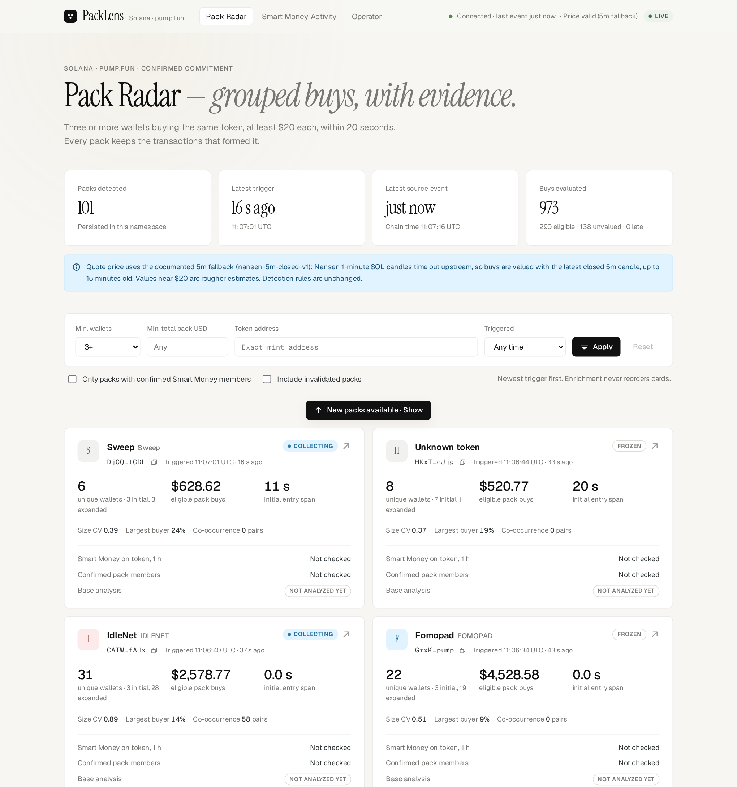
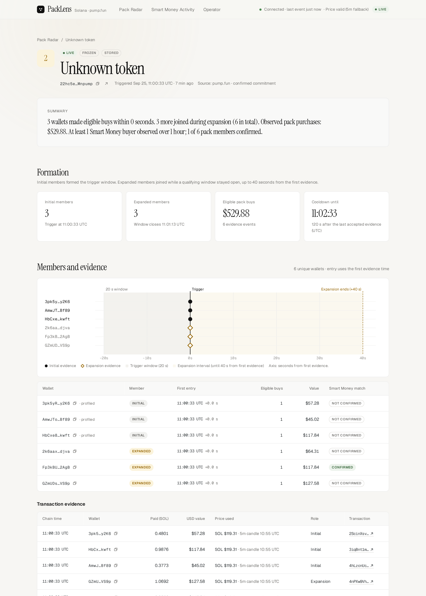
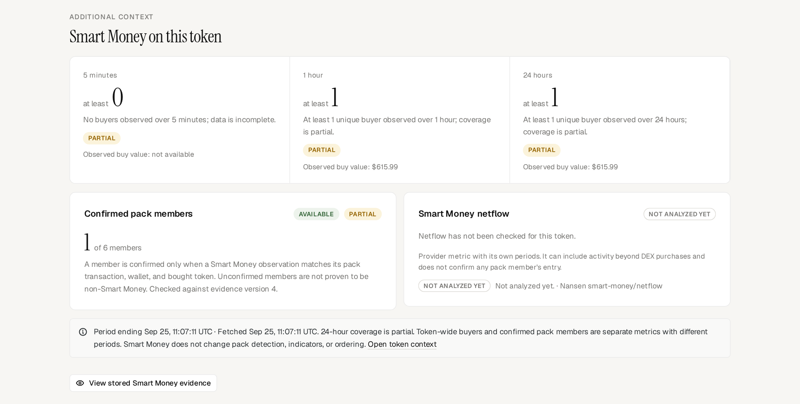
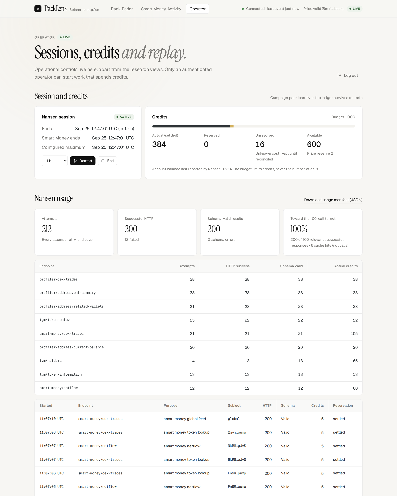
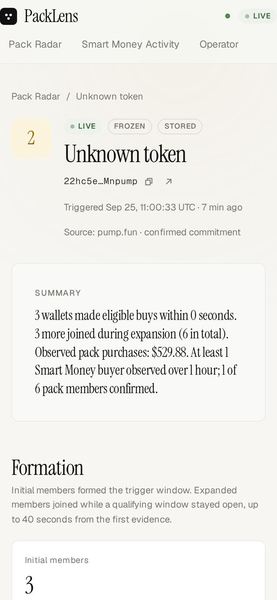

# PackLens

**An investigation radar for grouped token purchases on Solana pump.fun, with Nansen wallet, token, and Smart Money context.**

PackLens watches decoded pump.fun trades and flags a *pack* when at least three unique wallets each make an eligible buy of at least $20 of the same token within 20 seconds. Every pack keeps the exact transactions that formed it. Nansen then adds context: who the wallets are, how the token is held, and how many Smart Money wallets bought the token over 5 minutes, 1 hour, and 24 hours, kept strictly separate from how many *pack members* are confirmed Smart Money buyers.

PackLens finds events worth reviewing and shows what happened after them, so a trader can use it as one input to a decision. It does not predict prices, score wallets, give buy or sell signals, or trade.



---

## Contents

1. [What it does](#what-it-does)
2. [Reading the data and using it for decisions](#reading-the-data-and-using-it-for-decisions)
3. [Transaction source and pack rules](#transaction-source-and-pack-rules)
4. [Quote pricing and the documented 5m fallback](#quote-pricing-and-the-documented-5m-fallback)
5. [Smart Money: periods, matching, netflow, partial data](#smart-money-periods-matching-netflow-partial-data)
6. [Architecture and stack](#architecture-and-stack)
7. [Requirements and installation](#requirements-and-installation)
8. [Run offline with fixtures (no keys)](#run-offline-with-fixtures-no-keys)
9. [Run live](#run-live)
10. [Commands](#commands)
11. [Nansen endpoints, cache, and cost controls](#nansen-endpoints-cache-and-cost-controls)
12. [Verification results](#verification-results)
13. [Limitations and design choices](#limitations-and-design-choices)
14. [P0 and P1 status](#p0-and-p1-status)

---

## What it does

| Screen | Purpose |
|---|---|
| **Pack Radar** (`/`) | Newest packs first: token, copyable mint, unique wallets, eligible pack value, entry span, factual pattern indicators, *after the pack* (price now and peak versus the pack's entry, pack wallets that sold; refreshed every 20 s), analysis state, 1-hour Smart Money buyers, and confirmed pack members. New packs wait behind a *New packs available* control so the card you are reading never moves. |
| **Pack detail** (`/packs/:id`) | A plain-language *Reading this pack* panel (what happened, worth checking, not known); identity and mode; initial versus expanded members; a member timeline; the member table; every evidence transaction with its price provenance; pattern indicators with formulas; *After the pack* (price chart against the pack's entry with pack buys and pack-wallet sells, peak and low, per-wallet exits, buying versus selling since); *Earlier packs with these wallets* and their 15-minute moves; Smart Money on the token; wallet and token context; coverage limits and update history. |
| **Guide** (`/guide`) | How to read PackLens in three minutes: facts versus context, an annotated card, the pack page top to bottom, seven questions to ask before acting, the two Smart Money numbers, status labels, what PackLens cannot tell you, and a glossary. Every key number in the app has an ⓘ tip with the same definitions. |
| **Wallet** (`/wallets/solana/:address`) | Packs the wallet joined, 30-day PnL, 7-day DEX sample, provider-returned relationships, and balance follow-up. |
| **Token** (`/tokens/solana/:mint`) | Packs on the token (or *No pack detected in the monitored source*), Smart Money windows, netflow, token facts, and holders. |
| **Smart Money Activity** (`/smart-money`) | The shared Nansen Smart Money DEX feed with direction, scope, and whether a pack exists. Rows never create packs. |
| **Operator** (`/operator`) | Login, Nansen session, credit budget and ledger, usage by endpoint, collector health, job queue, replay, demo pins, and local analytics. |

Every screen shows the data **mode** (Live, Fixture, or Replay), and every Nansen panel states its source, period, fetch time, and state: *not analyzed yet*, *queued*, *observed empty*, *partial*, *stale*, *update delayed*, *unavailable from this source*, or *analysis paused*. Unknown is never shown as zero.

## Reading the data and using it for decisions

Start with the in-app **Guide** (`/guide`). In short:

- **Facts versus context.** Pack membership, amounts, prices after the pack, and sells come from the chain. Nansen data is context, always labeled with its source, period, and state, and never changes which packs exist.
- **After the pack** compares every later pump.fun trade with the pack's own average entry price in SOL (total SOL paid ÷ total tokens bought by the pack's evidence buys), so SOL/USD moves do not distort it. *Pack wallets sold* counts members that sold after their own first buy, with the share of their tokens sold and time to first sale. After a token completes its bonding curve, later trades happen elsewhere and are not observed; the page says so.
- **Earlier packs with these wallets** lists earlier packs that share at least two wallets and how those tokens moved over the next 15 minutes (peak and final), from stored trades.
- **Reading this pack** is generated from these facts with fixed templates, not a model. *Worth checking* points at facts such as members already selling, one wallet dominating the buying, same-second entries, or a price already far above the entry. It never recommends buying or selling and always states that the next price move is unknown.

Everything is computed from the local database; none of it spends Nansen credits.

## Transaction source and pack rules

- **Source:** Solana mainnet `logsSubscribe` on the pump.fun bonding-curve program `6EF8rrecthR5Dkzon8Nwu78hRvfCKubJ14M5uBEwF6P` at `confirmed` commitment. Failed transactions are ignored.
- **Decoder:** `TradeEvent` and `CreateEvent` from `Program data:` logs emitted while pump.fun is the executing program, pinned to the official IDL ([pump-public-docs](https://github.com/pump-fun/pump-public-docs) commit `81091419`, `idl/pump.json` sha256 `ffe966c4…064b`). The trading wallet is the event's `user`, never an assumed signer. Event time is the program's on-chain clock timestamp, never arrival time. Traded SOL is `sol_amount`, which excludes the protocol and creator fees (verified against a real transaction's balance change).
- **Detection (config `pack-baseline-v1`, locked):**
  - Trigger: at least **3 unique wallets**, each with an eligible buy of at least **$20 per transaction**, within an inclusive **20-second** window. Two $10 buys never combine.
  - Expansion: until **40 seconds from the first evidence**, while the rolling window still has three eligible wallets.
  - Cooldown: **120 seconds after the last newly accepted evidence**; a qualifying window exactly at expiry may trigger.
  - Ordering: a watermark trails the clock by **2 seconds**; events arriving behind it are *late* and never create live alerts.
- **Indicators (`patterns-v1`):** initial and all-member entry span, buy-size coefficient of variation (population), largest buyer share (not supply concentration), and co-occurrence pairs with earlier packs on other tokens within 24 hours. No combined score.
- **Coverage limits:** only pump.fun bonding-curve trades are observed (not PumpSwap or other DEXes). Collector disconnects are recorded as gaps and not backfilled in P0; affected packs say so.

## Quote pricing and the documented 5m fallback

USD value = traded SOL × a Nansen OHLCV **closed** candle close for WSOL, chosen once from snapshots available when the event first arrived (no look-ahead) and pinned to the event with its snapshot ID.

The P0 baseline is **1-minute** candles (policy `nansen-1m-closed-v1`, candle start at most 120 s before the trade). During live verification on 2026-09-25, Nansen answered every 1-minute WSOL request with HTTP 500 `query_timeout` after 30 seconds, even for a single minute, while 1-minute candles for ordinary tokens and 5-minute WSOL candles returned in under a second. With no price, no buy can pass the $20 check.

With the project owner's approval, live runs use the **documented fallback** `PRICE_TIMEFRAME=5m` (policy `nansen-5m-closed-v1`): still Nansen, still closed candles only, candle start at most **15 minutes** before the trade, snapshot freshness still 120 s. The policy version is recorded on every price snapshot and valuation and shown in the header, on the radar, and in each pack's evidence and coverage. Detection rules are unchanged. Values near $20 are rougher estimates under the fallback. Set `PRICE_TIMEFRAME=1m` to return to the baseline.

## Smart Money: periods, matching, netflow, partial data

- **Token buyers:** unique wallets that bought the exact mint in `(asOf − window, asOf]` for 5 minutes, 1 hour, and 24 hours, all from one `asOf`. A wallet that buys ten times counts once; a buyer who later sells stays a buyer; seller-only wallets never count; the $20 threshold does not apply here.
- **Confirmed pack members:** a member is confirmed only when a Smart Money observation matches the member's **pack transaction hash, wallet, and bought mint**. A wallet seen elsewhere is *wallet seen*, not confirmed. Unconfirmed never means proven not to be Smart Money. `2 of 5` always uses the total member count.
- **Coverage:** a single-page targeted lookup that reaches the last page is *window scanned* (the provider's response, not a census of the chain). Global-feed rows and multi-page scans are *partial*, shown as "at least N".
- **Observed buy value** sums only deduplicated trades with a USD value; missing values and ambiguous swaps are counted and shown.
- **Netflow** is Nansen's separate metric with its own periods (1h/24h/7d/30d). It is never mixed with buyer counts and never confirms an entry.
- **Invariance:** Smart Money writes only its own tables. Tests replay identical inputs with empty, zero, large, and failed Smart Money context and positive or negative netflow, and assert identical packs, members, evidence, indicators, cooldown, base assessment, and enrichment priority.

## Architecture and stack

```text
Solana RPC logsSubscribe ─▶ collector + pinned pump.fun decoder
Nansen OHLCV (quote price) ─▶ normalization + valuation (closed candle, pinned)
                              ─▶ ordering buffer + 2 s watermark
                              ─▶ pure pack detector ──▶ SQLite (atomic evidence, checkpoints, outbox)
                                                         ├─▶ read API + SSE ─▶ React UI
                                                         └─▶ job queue ─▶ Nansen client (ledger, budget, cache, single-flight)
                                                                          ├─▶ base context + assessment
                                                                          └─▶ Smart Money observations ─▶ windows, matching, netflow
```

- **One backend process** (Node 24, TypeScript strict, Fastify 5) owns the collector, detector, queue, API, and SSE. **SQLite** (better-sqlite3, WAL, foreign keys on) stores events, packs, snapshots, the ledger, and restart state. **React 19 + Vite 8** renders snapshots; SSE announces changes.
- **Namespaces** (`live:`, `fixture:`, `replay:`) are enforced with composite foreign keys; replay never touches live data.
- **Boundaries:** the detector and pattern modules are pure and may not import Smart Money, providers, storage, or network code (`npm run lint` enforces it; runtime tests prove it).
- **Design:** warm monochrome editorial interface (Instrument Serif, Geist, Geist Mono), flat bordered surfaces, muted pastel state tags that always carry text, keyboard-accessible cards, and a 360 px layout.

Code map: `apps/server/src` (`collector/`, `normalization/`, `detector/`, `patterns/`, `ingest/`, `prices/`, `adapters/nansen/`, `scheduler/`, `enrichment/`, `smart-money/`, `assessment/`, `api/`, `replay/`, `operations/`), `apps/web/src`, `packages/contracts`, `migrations/`, `tests/`, `fixtures/`, `docs/`.

## Requirements and installation

- Node.js **24** and npm 11 (`engines` is enforced), a C toolchain only if `better-sqlite3` has no prebuilt binary for your platform.
- Install exactly from the lockfile:

```bash
cd packlens
npm ci
```

## Run offline with fixtures (no keys)

```bash
npm run dev          # server on :8787 (fixture mode) + Vite on http://127.0.0.1:5173
# or the production build:
npm run build && npm run start   # http://127.0.0.1:8787
```

Fixture mode seeds the registered synthetic dataset `synthetic-demo-v1` (five tokens, five packs, a late event, a price outage, and provider-shaped context covering every panel state). Everything is labeled **Fixture**; no provider is ever called.

## Run live

1. Copy `.env.example` to `.env` and fill in the live block:
   - `NANSEN_API_KEY` (backend only; sent only in the `apikey` header),
   - `NANSEN_BUDGET_CREDITS` (a hard credit budget; no paid request is sent without it),
   - `ADMIN_TOKEN` (32+ random characters; the operator login),
   - `SOLANA_RPC_HTTP_URL` / `SOLANA_RPC_WS_URL` (the public mainnet RPC works; a keyed RPC is more robust),
   - `SMART_MONEY_ENABLED=true`, and `PRICE_TIMEFRAME=5m` while Nansen's 1m WSOL candles time out.
2. Set the session window: `npm run session:set -- 2h` (writes `NANSEN_SESSION_END_AT`; every Nansen poller stops at that time).
3. Check access and schemas with a small, budgeted smoke test (about 26 credits):

```bash
npm run verify:live   # RPC + decoder check, then all nine Nansen endpoints on real subjects
```

4. Start the app:

```bash
npm run build
APP_MODE=live npm run start      # http://127.0.0.1:8787
```

Open `/operator`, log in with `ADMIN_TOKEN`, and watch credits, usage, and jobs. Base enrichment picks up to `ENRICHMENT_AUTO_PACKS_PER_CYCLE` new packs every 5 minutes (largest first; never by Smart Money). Any other live pack can be enriched from its detail page with **Run base analysis**, and **Pin token for demo** keeps its Smart Money context refreshed. Public pages never trigger paid requests.

To record a real window for a reproducible demo: `npm run dataset:export -- --id recorded-demo-1 --from <ISO> --to <ISO>`, then `npm run replay -- --dataset recorded-demo-1 --mode recorded-arrival`. Replays keep original times, pinned prices, and admission decisions, and are labeled **Replay**.

## Commands

| Command | What it does |
|---|---|
| `npm ci` | Clean install from the lockfile. |
| `npm run dev` | Server (fixture by default, no provider calls) and Vite dev server. |
| `npm run build` | Builds server and web without keys. |
| `npm run start` | Runs the built app in the configured `APP_MODE`. |
| `npm run typecheck` | Strict TypeScript across contracts, server, web, and tests. |
| `npm run lint` | ESLint, including the detector/pattern import boundaries. |
| `npm test` | Unit, contract, and integration tests on fixtures; no paid HTTP. |
| `npm run test:e2e` | Builds, starts a fixture server on a temporary database, and runs the Playwright browser journeys. |
| `npm run db:migrate` | Applies versioned, checksummed migrations to the configured database. |
| `npm run db:schema-doc` | Regenerates `docs/db-schema.md` from the migrations. |
| `npm run replay -- --dataset <id> --mode recorded-arrival` | Replays a registered dataset into a new replay namespace and prints the digest. |
| `npm run dataset:export -- --id <id> --from <ISO> --to <ISO>` | Exports a real live window with pinned valuations as a replayable dataset. |
| `npm run verify:live` | Keyed, budgeted, session-bounded live smoke test; every call enters the ledger. Evidence: `docs/compatibility/verify-live-latest.json`. |
| `npm run usage:manifest` | Writes the aggregate usage manifest `docs/usage-manifest.json`. |
| `npm run session:set -- 2h` | Sets `NANSEN_SESSION_END_AT` in `.env`. |
| `npm run fixtures:generate` | Regenerates the synthetic fixture dataset and manifest. |

## Nansen endpoints, cache, and cost controls

| Endpoint | Used for | Credits | Cache |
|---|---|---:|---|
| `tgm/token-ohlcv` | WSOL quote price (5m fallback or 1m baseline), polled every 30 s in a session | 1 | none (poll) |
| `tgm/token-information` | Token facts, supply for concentration | 1 | 120 s |
| `tgm/holders` (`premium_labels=false`) | First 20 holders | 5 | 300 s |
| `profiler/address/pnl-summary` | 30-day PnL for the first three initial members | 1 | 60 min |
| `profiler/dex-trades` | 7-day trade sample (one page of 100) | 1 | 5 min |
| `profiler/address/related-wallets` | Relationships for the first two members | 1 | 15 min |
| `profiler/address/current-balance` | Pack-token balance 5 minutes after the trigger | 1 | 60 s |
| `smart-money/dex-trades` | Global feed every 120 s; targeted lookup per pack token | 5 | 120 s per mint |
| `smart-money/netflow` | Per-token netflow | 5 | 5 min |

- **Ledger:** every attempt, retry, and page is a row with HTTP and schema outcomes, quoted and actual credits (`X-Nansen-Credits-Used`), and provider request ID. Credits are **reserved atomically before sending**, settled with the actual cost, and kept **unresolved** when the outcome is unknown (timeouts). Two price polls stay reserved from enrichment. The budget limits credits, **never the number of calls**; 100 relevant successful calls is a reporting target only.
- **Rate and concurrency:** 2 concurrent requests, 30 per minute, lane priority PRICE → BASE_ENRICHMENT → SMART_MONEY, `Retry-After` honored, at most two retries with full jitter.
- **Failures:** 401/403 and 402 pause paid dispatch; 400/422 are never retried; schema changes fail normalization loudly and still settle the charge; a failed refresh keeps the previous snapshot readable as *update delayed*.
- **Single-flight and cache:** identical concurrent requests share one upstream call; cache hits are counted separately and are not provider calls.

## Verification results

Full report with commands and outputs: [`docs/test-report.md`](docs/test-report.md).

- **Offline (G0):** `npm ci`, `npm run typecheck`, `npm run lint` (with detector/pattern import boundaries), `npm test` (**143 tests**: boundaries T01–T14/T47–T50, vectors V01–V11, valuation, decoder on real transactions, Smart Money windows and matching, invariance, ledger, client error policy, API, SSE, replay, config, and an end-to-end live flow against a fake provider), and `npm run test:e2e` (**9 browser journeys**) all pass.
- **Live integration (G1):** `npm run verify:live` passed **11/11** on 2026-09-25 against Solana mainnet and Nansen, using the 5m price fallback.
- **Live usage (G3/G4), 2026-09-25 10:57–11:12 UTC:** 24,490 real pump.fun trades decoded (0.34% late, 0 unpriced SOL trades), **149 packs** detected (largest 108 wallets), 15 packs analyzed, 136 Smart Money observations, and one pack with a confirmed Smart Money member (1 of 6, matched by transaction hash, wallet, and mint). Four graceful restarts preserved packs, cooldowns, the session, and the ledger.
- **Nansen usage:** 272 attempts, **260 schema-valid responses** (the 100-call target is met), 492 credits settled, 16 unresolved (timeouts), 6 cache hits. Aggregate manifest: [`docs/usage-manifest.json`](docs/usage-manifest.json).

| Pack detail (live) | Smart Money on the token (live) |
|---|---|
|  |  |

| Operator (live) | Mobile, 390 px (live) |
|---|---|
|  |  |

## Limitations and design choices

- Inspired by the public detection patterns of [WolfBrain](https://www.wolfbrain.online/). PackLens uses its own implementation and rules; identical output is not claimed.
- pump.fun bonding-curve trades only; SOL-quoted pairs only (other quotes are recorded as `unsupported_quote`).
- The public Solana RPC can disconnect; disconnects become visible gaps, not backfilled data.
- Nansen data has its own indexing delay; panels show fetch time and period and never claim on-chain freshness.
- The 5m price fallback trades precision near the $20 boundary for having any valuation at all (see above).
- Holder concentration uses verified total supply; the first holder page describes only the observed portion. `CHECK_CONCENTRATION` requires an explicit `HOLDER_CONCENTRATION_THRESHOLD`.
- A relationship returned by the provider does not prove common ownership; Smart Money is a provider category, not a prediction.
- *After the pack* sees pump.fun bonding-curve trades only (no transfers, no other venues, nothing after graduation), and live trades older than 24 hours are pruned unless they are pack evidence, so long histories may be incomplete. Past moves do not predict future moves.
- Single instance, local by default. Public hosting needs HTTPS, `SECURE_COOKIES=true`, and `ALLOWED_ORIGINS`.

## P0 and P1 status

**Implemented (P0):** collector and pinned decoder, closed-candle valuation with provenance, ordering buffer and watermark, pure detector with expansion and cooldown, atomic persistence with outbox and restart recovery, factual indicators, base enrichment and assessment, Smart Money feed, windows, matching and netflow, ledger, budget, sessions, rate limits and single-flight, operator authentication with idempotent mutations, replay and dataset export, radar, detail, wallet, token, Smart Money, and operator screens, SSE, and local analytics.

**Not in P0 (P1):** combined numeric score, behavior classification, interactive relationship graphs, Smart Money Holdings, card export, saved filters, LLM explanations, viewer-driven refresh, backfill after gaps, and additional quote assets.
